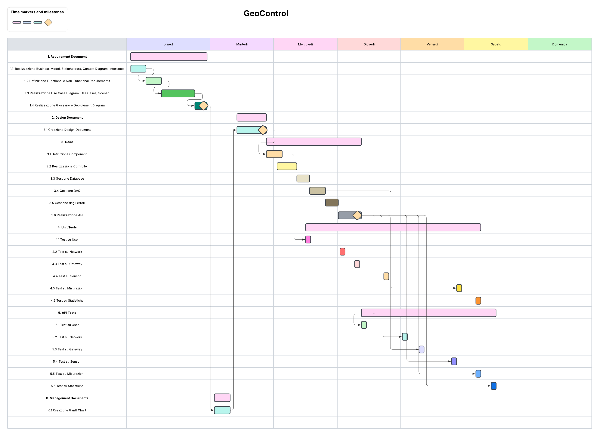

# Project Estimation

Date: 18/04/2025

Version: 1.0

# Estimation approach

Consider the GeoControl project as described in the swagger, assume that you are going to develop the project INDEPENDENT of the deadlines of the course, and from scratch

# Estimate by size

###

|         | Estimate |
| ------- | -------- |
| NC = Estimated number of classes to be developed  |    6      |
| A = Estimated average size per class, in LOC        |    150    |
| S = Estimated size of project, in LOC (= NC \* A)         |       900   |
| E = Estimated effort, in person hours (here use productivity 10 LOC per person hour)  | 90      |
| C = Estimated cost, in euro (here use 1 person hour cost = 30 euro)  |   2700   |
| Estimated calendar time, in calendar weeks (Assume team of 4 people, 8 hours per day, 5 days per week ) |  meno di 1 settimana  |

# Estimate by product decomposition

###

| component name | Estimated effort (person hours) |
| -------------------- | -------------------- |
| requirement document |    20      |
| design document      |     12     |
| code        |         48      |
| unit tests  |         10     |
| api tests   |         10      |
| management documents |      5        |

# Estimate by activity decomposition

###

| Activity name                                                               | Estimated effort (person hours) |
|-----------------------------------------------------------------------------| ------------------------------- |
 **1. Requirement Document**                                                 | **32** |
| 1.1 Realizzazione Business model, Stakeholders, Context Diagram, Interfaces | 7 |
| 1.2 Definizione Functional e Non-functional Requirements                    | 5 |
| 1.3 Realizzazione Use Case Diagram, Use Cases, Scenari                      | 15 |
| 1.4 Realizzazione Glossary e Deployment Diagram                             | 5 |
| **2. Design Document**                                                      | **12** |
| **3. Code**                                                                 | **50** |
| 3.1 Definizione Componenti                                                  | 8 |
| 3.2 Realizzazione Controller                                                | 10 |
| 3.3 Gestione DAO                                                            | 8 |
| 3.4 Gestione DB                                                             | 6 |
| 3.5 Gestione degli errori                                                   | 6 |
| 3.6 Realizzazione API                                                       | 12 |
| **4. Unit Tests**                                                           | **12** |
| 4.1 Test su User                                                            | 2 |
| 4.2 Test su Network                                                         | 2 |
| 4.3 Test su Gateway                                                         | 2 |
| 4.4 Test su Sensori                                                         | 2 |
| 4.5 Test su Misurazioni                                                     | 2 |
| 4.6 Test su Statistiche                                                     | 2 |
| **5. API Tests**                                                            | **12** |
| 5.1 Test su User                                                            | 2 |
| 5.2 Test su Network                                                         | 2 |
| 5.3 Test su Gateway                                                         | 2 |
| 5.4 Test su Sensori                                                         | 2 |
| 5.5 Test su Misurazioni                                                     | 2 |
| 5.6 Test su Statistiche                                                     | 2 |
| **6. Management Documents**                                                 | **2** |
| 6.1 Creazione Gantt Chart                                                   | 2 |

###

Insert here Gantt chart with above activities

# Summary

Report here the results of the three estimation approaches. The estimates may differ. Discuss here the possible reasons for the difference

| | Estimated effort | Estimated duration |
| ---------------------------------- | ---------------- | ------------------ |
| estimate by size  | 90 | 0.565  |
| estimate by product decomposition  | 105  | 0.656  |
| estimate by activity decomposition | 120  | 0.75  |

Le tre stime differiscono tra loro poiché la stima *by size* si concentra principalmente sulla parte di codice del prodotto, mentre le stime *by product decomposition* e *by activity decomposition* prendono in considerazione lo sviluppo dell'intero prodotto.

In particolare, tra le tre stime, la più dettagliata è la stima *by activity decomposition* poiché permette di suddividere ogni componente in attività e di analizzare queste ultime singolarmente. Inoltre, attraverso il Gantt Chart è possibile segnalare ulteriori criticità tra le varie attività, dovute al fatto che alcune di esse non possono essere eseguite in parallelo ad altre poiché dipendenti tra loro.