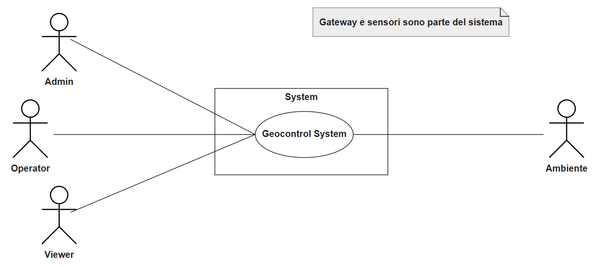
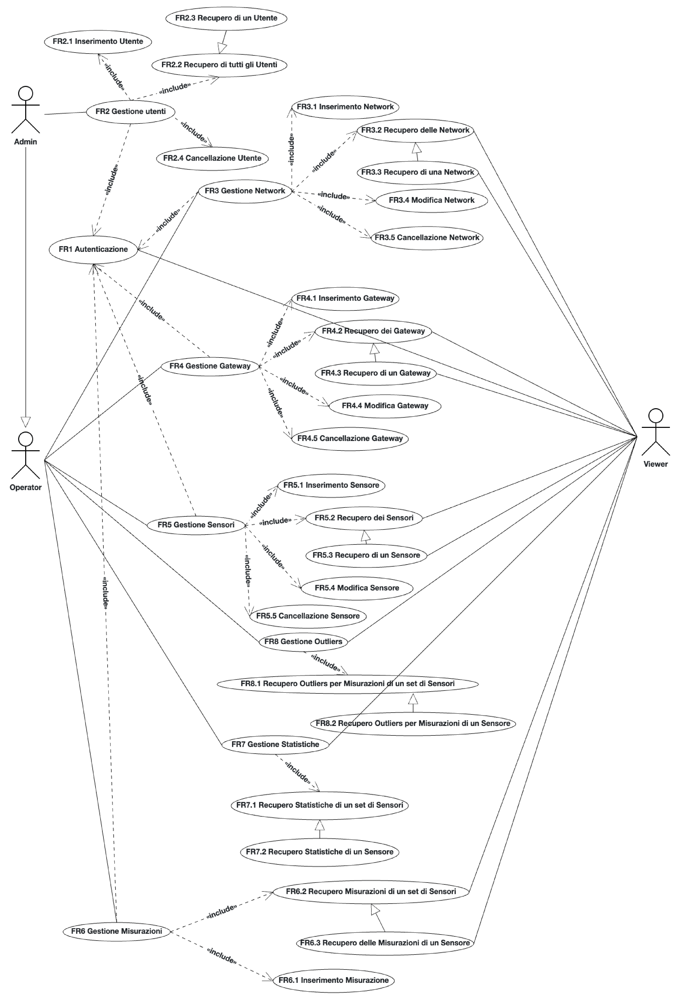
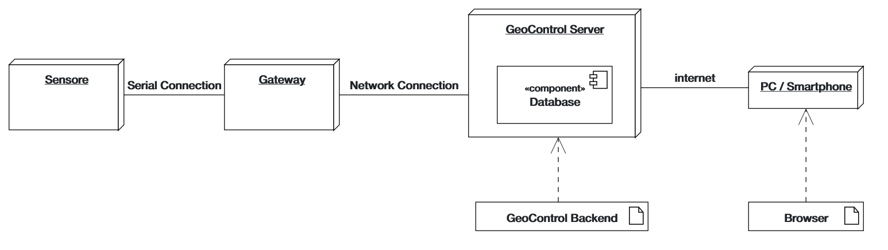

# Requirements Document - GeoControl

Date: 18 Aprile 2025

Version: V2 - Versione finale

| Version number | Change |
| :------------: | :----: |
|                |        |

# Contents

- [Requirements Document - GeoControl](#requirements-document---geocontrol)
- [Contents](#contents)
- [Informal description](#informal-description)
- [Business model](#business-model)
- [Stakeholders](#stakeholders)
- [Context Diagram and interfaces](#context-diagram-and-interfaces)
  - [Context Diagram](#context-diagram)
  - [Interfaces](#interfaces)
- [Stories and personas](#stories-and-personas)
- [Functional and non functional requirements](#functional-and-non-functional-requirements)
  - [Functional Requirements](#functional-requirements)
  - [Non Functional Requirements](#non-functional-requirements)
- [Use case diagram and use cases](#use-case-diagram-and-use-cases)
  - [Use case diagram](#use-case-diagram)
    - [Use case 1, UC1 - Autenticazione utente](#use-case-1-uc1---autenticazione-utente)
      - [Scenario 1.1](#scenario-11)
      - [Scenario 1.2](#scenario-12)
      - [Scenario 1.3](#scenario-13)
      - [Scenario 1.4](#scenario-14)
      - [Scenario 1.5](#scenario-15)
    - [Use case 2, UC2 - Recupero di tutti gli utenti](#use-case-2-uc2---recupero-di-tutti-gli-utenti)
      - [Scenario 2.1](#scenario-21)
      - [Scenario 2.2](#scenario-22)
      - [Scenario 2.3](#scenario-23)
      - [Scenario 2.4](#scenario-24)
    - [Use case 3, UC3 - Creazione di un nuovo utente](#use-case-3-uc3---creazione-di-un-nuovo-utente)
      - [Scenario 3.1](#scenario-31)
      - [Scenario 3.2](#scenario-32)
      - [Scenario 3.3](#scenario-33)
      - [Scenario 3.4](#scenario-34)
      - [Scenario 3.5](#scenario-35)
      - [Scenario 3.6](#scenario-36)
    - [Use case 4, UC4 - Recupero di uno utente specifico](#use-case-4-uc4---recupero-di-uno-utente-specifico)
      - [Scenario 4.1](#scenario-41)
      - [Scenario 4.2](#scenario-42)
      - [Scenario 4.3](#scenario-43)
      - [Scenario 4.4](#scenario-44)
      - [Scenario 4.5](#scenario-45)
    - [Use case 5, UC5 - Eliminazione di un utente](#use-case-5-uc5---eliminazione-di-un-utente)
      - [Scenario 5.1](#scenario-51)
      - [Scenario 5.2](#scenario-52)
      - [Scenario 5.3](#scenario-53)
      - [Scenario 5.4](#scenario-54)
      - [Scenario 5.5](#scenario-55)
    - [Use case 6, UC6 - Recupero di tutte le Network](#use-case-6-uc6---recupero-di-tutte-le-network)
      - [Scenario 6.1](#scenario-61)
      - [Scenario 6.2](#scenario-62)
      - [Scenario 6.3](#scenario-63)
    - [Use case 7, UC7 - Creazione di una nuova Network](#use-case-7-uc7---creazione-di-una-nuova-network)
      - [Scenario 7.1](#scenario-71)
      - [Scenario 7.2](#scenario-72)
      - [Scenario 7.3](#scenario-73)
      - [Scenario 7.4](#scenario-74)
      - [Scenario 7.5](#scenario-75)
      - [Scenario 7.6](#scenario-76)
    - [Use case 8, UC8 - Recupero di una Network specifica](#use-case-8-uc8---recupero-di-una-network-specifica)
      - [Scenario 8.1](#scenario-81)
      - [Scenario 8.2](#scenario-82)
      - [Scenario 8.3](#scenario-83)
      - [Scenario 8.4](#scenario-84)
    - [Use case 9, UC9 - Aggiornamento di una Network](#use-case-9-uc9---aggiornamento-di-una-network)
      - [Scenario 9.1](#scenario-91)
      - [Scenario 9.2](#scenario-92)
      - [Scenario 9.3](#scenario-93)
      - [Scenario 9.4](#scenario-94)
      - [Scenario 9.5](#scenario-95)
      - [Scenario 9.6](#scenario-96)
      - [Scenario 9.7](#scenario-97)
    - [Use case 10, UC10 - Eliminazione di una Network](#use-case-10-uc10---eliminazione-di-una-network)
      - [Scenario 10.1](#scenario-101)
      - [Scenario 10.2](#scenario-102)
      - [Scenario 10.3](#scenario-103)
      - [Scenario 10.4](#scenario-104)
      - [Scenario 10.5](#scenario-105)
    - [Use case 11, UC11 - Recupero di tutti i Gateway di una Network](#use-case-11-uc11---recupero-di-tutti-i-gateway-di-una-network)
      - [Scenario 11.1](#scenario-111)
      - [Scenario 11.2](#scenario-112)
      - [Scenario 11.3](#scenario-113)
      - [Scenario 11.4](#scenario-114)
      - [Scenario 11.5](#scenario-115)
    - [Use case 12, UC12 - Creazione di un Gateway per una Network](#use-case-12-uc12---creazione-di-un-gateway-per-una-network)
      - [Scenario 12.1](#scenario-121)
      - [Scenario 12.2](#scenario-122)
      - [Scenario 12.3](#scenario-123)
      - [Scenario 12.4](#scenario-124)
      - [Scenario 12.5](#scenario-125)
      - [Scenario 12.6](#scenario-126)
    - [Use case 13, UC13 - Recupero di un Gateway specifico](#use-case-13-uc13---recupero-di-un-gateway-specifico)
      - [Scenario 13.1](#scenario-131)
      - [Scenario 13.2](#scenario-132)
      - [Scenario 13.3](#scenario-133)
      - [Scenario 13.4](#scenario-134)
    - [Use case 14, UC14 - Aggiornamento di un Gateway](#use-case-14-uc14---aggiornamento-di-un-gateway)
      - [Scenario 14.1](#scenario-141)
      - [Scenario 14.2](#scenario-142)
      - [Scenario 14.3](#scenario-143)
      - [Scenario 14.4](#scenario-144)
      - [Scenario 14.5](#scenario-145)
      - [Scenario 14.6](#scenario-146)
    - [Use case 15, UC15 - Eliminazione di un Gateway](#use-case-15-uc15---eliminazione-di-un-gateway)
      - [Scenario 15.1](#scenario-151)
      - [Scenario 15.2](#scenario-152)
      - [Scenario 15.3](#scenario-153)
      - [Scenario 15.4](#scenario-154)
      - [Scenario 15.5](#scenario-155)
    - [Use case 16, UC16 - Recupero di tutti i sensori di un Gateway](#use-case-16-uc16---recupero-di-tutti-i-sensori-di-un-gateway)
      - [Scenario 16.1](#scenario-161)
      - [Scenario 16.2](#scenario-162)
      - [Scenario 16.3](#scenario-163)
      - [Scenario 16.4](#scenario-164)
    - [Use case 17, UC17 - Creazione di un nuovo sensore per un Gateway](#use-case-17-uc17---creazione-di-un-nuovo-sensore-per-un-gateway)
      - [Scenario 17.1](#scenario-171)
      - [Scenario 17.2](#scenario-172)
      - [Scenario 17.3](#scenario-173)
      - [Scenario 17.4](#scenario-174)
      - [Scenario 17.5](#scenario-175)
      - [Scenario 17.6](#scenario-176)
      - [Scenario 17.7](#scenario-177)
    - [Use case 18, UC18 - Recupero di un sensore specifico](#use-case-18-uc18---recupero-di-un-sensore-specifico)
      - [Scenario 18.1](#scenario-181)
      - [Scenario 18.2](#scenario-182)
      - [Scenario 18.3](#scenario-183)
      - [Scenario 18.4](#scenario-184)
    - [Use case 19, UC19 - Aggiornamento di un sensore](#use-case-19-uc19---aggiornamento-di-un-sensore)
      - [Scenario 19.1](#scenario-191)
      - [Scenario 19.2](#scenario-192)
      - [Scenario 19.3](#scenario-193)
      - [Scenario 19.4](#scenario-194)
      - [Scenario 19.5](#scenario-195)
      - [Scenario 19.6](#scenario-196)
      - [Scenario 19.7](#scenario-197)
    - [Use case 20, UC20 - Eliminazione di un sensore](#use-case-20-uc20---eliminazione-di-un-sensore)
      - [Scenario 20.1](#scenario-201)
      - [Scenario 20.2](#scenario-202)
      - [Scenario 20.3](#scenario-203)
      - [Scenario 20.4](#scenario-204)
      - [Scenario 20.5](#scenario-205)
    - [Use case 21, UC21 - Recupero delle misurazioni di un insieme di sensori appartententi a un network](#use-case-21-uc21---recupero-delle-misurazioni-di-un-insieme-di-sensori-appartententi-a-un-network)
      - [Scenario 21.1](#scenario-211)
      - [Scenario 21.2](#scenario-212)
      - [Scenario 21.3](#scenario-213)
      - [Scenario 21.4](#scenario-214)
    - [Use case 22, UC22 - Recupero delle statistiche di un insieme di sensori appartententi a un network](#use-case-22-uc22---recupero-delle-statistiche-di-un-insieme-di-sensori-appartententi-a-un-network)
      - [Scenario 22.1](#scenario-221)
      - [Scenario 22.2](#scenario-222)
      - [Scenario 22.3](#scenario-223)
      - [Scenario 22.4](#scenario-224)
    - [Use case 23, UC23 - Recupero delle misurazioni outlier di un insieme di sensori appartententi a un network](#use-case-23-uc23---recupero-delle-misurazioni-outlier-di-un-insieme-di-sensori-appartententi-a-un-network)
      - [Scenario 23.1](#scenario-231)
      - [Scenario 23.2](#scenario-232)
      - [Scenario 23.3](#scenario-233)
      - [Scenario 23.4](#scenario-234)
    - [Use case 24, UC24 - Archiviazione della misurazione di un sensore](#use-case-24-uc24---archiviazione-della-misurazione-di-un-sensore)
      - [Scenario 24.1](#scenario-241)
      - [Scenario 24.2](#scenario-242)
      - [Scenario 24.3](#scenario-243)
      - [Scenario 24.4](#scenario-244)
      - [Scenario 24.5](#scenario-245)
      - [Scenario 24.6](#scenario-246)
    - [Use case 25, UC25 - Recupero delle misurazioni da uno specifico sensore](#use-case-25-uc25---recupero-delle-misurazioni-da-uno-specifico-sensore)
      - [Scenario 25.1](#scenario-251)
      - [Scenario 25.2](#scenario-252)
      - [Scenario 25.3](#scenario-253)
      - [Scenario 25.4](#scenario-254)
    - [Use case 26, UC26 - Recupero delle statistiche di uno specifico sensore](#use-case-26-uc26---recupero-delle-statistiche-di-uno-specifico-sensore)
      - [Scenario 26.1](#scenario-261)
      - [Scenario 26.2](#scenario-262)
      - [Scenario 26.3](#scenario-263)
      - [Scenario 26.4](#scenario-264)
    - [Use case 27, UC27 - Recupero delle misurazioni outlier da uno specifico sensore](#use-case-27-uc27---recupero-delle-misurazioni-outlier-da-uno-specifico-sensore)
      - [Scenario 27.1](#scenario-271)
      - [Scenario 27.2](#scenario-272)
      - [Scenario 27.3](#scenario-273)
      - [Scenario 27.4](#scenario-274)
- [Glossary](#glossary)
- [System Design](#system-design)
- [Deployment Diagram](#deployment-diagram)

# Informal description

GeoControl is a software system designed for monitoring physical and environmental variables in various contexts: from hydrogeological analyses of mountain areas to the surveillance of historical buildings, and even the control of internal parameters (such as temperature or lighting) in residential or working environments.

# Business Model

GeoControl è un sistema progettato per la raccolta, il monitoraggio e la statistica di dati ambientali attraverso l'uso un'infrastruttura distribuita su tutto il territorio. Il sistema è composto vari **network** logici, ognuno dei quali rappresenta una determinata area geografica, e da **gateway** e **sensori** fisici che si occupano della raccolta e della trasmissione delle misurazioni prelevate.

Il servizio è fornito su base contrattuale (SaaS) da GeoControl ed è rivolto ad **aziende** e **organizzazioni** interessate ad utilizzare ed analizzare i dati raccolti dall'infrastruttura disposta da GeoControl.
Ne consegue che: 

1. GeoControl è responsabile sia della distribuzione di nuovi sensori e gateway presso il territorio, sia della manutenzione di sensori e gateway già dislocati.
2. I dati raccolti vengono inviati ai server GeoControl, dove vengono archiviati e messi a disposizione dei clienti abbonati al servizio.
3. I clienti sottoscrivono un contratto con GeoControl per accedere ai dati e non hanno bisogno di installare o mantenere alcuna infrastruttura.

In quanto commissionato originariamente dalla Unione Nazionale Comunità ed Enti Montani della Regione Piemonte, questo ente è esente dal pagamento del servizio.

# Stakeholders

| Stakeholder name | Description |
| :--------------: | :---------: |
| Clienti finali (Viewer)  | Aziende e organizzazioni pubbliche e private che necessitano delle misurazioni per i loro scopi |
| Operator | Tecnici di GeoControl che si occupano della manutenzione dell'infrastruttura |
| Admin | Personale di GeoControl con accesso completo alla gestione di rete e utenti |
| Fornitori di Hardware | Aziende che forniscono i sensori e i gateway necessari all'infrastruttura |
| Competitors | Aziende concorrenti con soluzioni simili a GeoControl |
| Ambiente | Aree su cui vengono effettuate le misurazioni |
| Unione Nazionale Comunità ed Enti Montani della Regione Piemonte | Committente iniziale, interessato nel monitoraggio idrogeologico |

# Context Diagram and interfaces

## Context Diagram



## Interfaces


|  Actor   |           Logical Interface           | Physical Interface |
|:--------:|:-------------------------------------:|:------------------:|
|  Admin   |                  GUI                  |         PC         |
| Operator |                  GUI                  |   PC/Smartphone    |
|  Viewer  |                  GUI                  |   PC/Smartphone    |
| Ambiente | Interazione indiretta tramite sensori |      Sensore       |
  
# Stories and personas

### Nicolò – Admin

Nicolò è un sistemista esperto. Utilizza GeoControl per configurare le nuove reti di monitoraggio e gestire gli utenti. Quando viene installata una nuova infrastruttura in un comune è lui a creare i corrispettivi oggetti nel sistema (network, gateway, sensori). Supervisiona anche l’accesso alle API e verifica che le autorizzazioni siano correttamente distribuite tra gli operatori e i visualizzatori.

### Marco – Tecnico (Operator)

Marco è un tecnico di campo. Si reca spesso in aree montane per installare e controllare i sensori. Una volta sul campo, aggiorna la topologia sul sistema GeoControl: aggiunge gateway e sensori, elimina quelli guasti, e carica i dati di misura. Usa il sistema per controllare che le misurazioni siano regolari e per identificare anomalie. Non ha accesso alla gestione utenti, ma ha pieno controllo sui dispositivi.

### Gabriele – Ricercatore ambientale (Viewer)

Gabriele è un dottorando in ingegneria ambientale. Il suo progetto di ricerca si basa sull’analisi dei dati raccolti dai sensori installati su versanti instabili. Utilizza GeoControl per esportare serie storiche di misurazioni, che poi elabora tramite software statistici esterni. Il suo lavoro non prevede la modifica della configurazione dei dispositivi, ma ha bisogno di un accesso accurato e completo ai dati raccolti. Spesso filtra i dati per intervallo temporale e sensori specifici per analizzare trend e anomalie.

### Francesco – Responsabile comunale (Viewer)

Francesco lavora nell’ufficio tecnico del Comune di Vinadio. Utilizza GeoControl per monitorare le condizioni idrogeologiche del territorio. Ogni settimana accede alla piattaforma per consultare grafici, verificare la presenza di outlier e generare report da condividere con il sindaco e la protezione civile. Anche se non può intervenire direttamente sulla rete o sui dispositivi, è in grado di prendere decisioni informate grazie alla chiarezza e precisione dei dati forniti.

# Functional and non functional requirements

## Functional Requirements

|  ID   | Description |
| :---: | :---------: |
| FR1 | Autenticazione utente |
|  FR1.1  | Login |
| FR2 | Gestione utenti
|  FR2.1  | Inserimento utente |
|  FR2.2  | Recupero informazioni di tutti gli utenti |
|  FR2.3  | Recupero informazioni di un utente |
|  FR2.4  | Cancellazione utente |
| FR3 | Gestione Network |
|  FR3.1 | Inserimento Network
|  FR3.2 | Recupero informazioni di tutti i Network |
|  FR3.3 | Recupero informazioni di un Network |
|  FR3.4 | Modifica Network |
|  FR3.5 | Cancellazione Network |
| FR4 | Gestione Gateway |
|  FR4.1 | Inserimento Gateway |
|  FR4.2 | Recupero informazioni di tutti i Gateway di un Network |
|  FR4.3 | Recupero informazioni di un Gateway in un Network |
|  FR4.4 | Modifica Gateway |
|  FR4.5 | Cancellazione Gateway |
| FR5 | Gestione Sensori |
|  FR5.1 | Inserimento Sensore per un Gateway |
|  FR5.2 | Recupero informazioni di tutti i Sensori di un Gateway |
|  FR5.3 | Recupero informazioni di un Sensore |
|  FR5.4 | Modifica Sensore |
|  FR5.5 | Cancellazione Sensore |
| FR6 | Gestione Misurazioni  |
|  FR6.1 | Inserimento Misurazione per un Sensore |
|  FR6.1.1 | Conversione Timestamp in ISO 8601 privo di fusorario |
|  FR6.2 | Recupero Misurazioni di un insieme di Sensori di un Network |
|  FR6.3 | Recupero Misurazioni di un Sensore |
| FR7 | Gestione Statistiche |
|  FR7.1 | Recupero Statistiche di un insieme di Sensori di un Network |
|  FR7.2 | Recupero Statistiche di un Sensore |
|  FR7.3 | Calcolo Media |
|  FR7.4 | Calcolo Varianza |
|  FR7.5 | Calcolo Threshold |
|  FR8 | Gestione Outliers |
|  FR8.1 | Recupero Outliers per Misurazioni di un insieme di Sensori di un Network |
|  FR8.2 | Recupero Outliers per Misurazioni di un Sensore|


## Non Functional Requirements


|  ID  | Type (efficiency, reliability, ..) |                                                    Description                                                     | Refers to |
|:----:|:----------------------------------:|:------------------------------------------------------------------------------------------------------------------:|:---------:|
| NFR1 |             Sicurezza              |                      Il sistema deve utilizzare un sistema di autenticazione basato su token                       |   FR1.1   |
| NFR2 |            Prestazioni             |                         Un sensore deve effettuare una nuova Misurazione ogni 10 minuti                            |   FR10    |
| NFR3 |              Dominio               | Il Timestamp generato dal sensore deve rispettare il formato ISO 8601 ed includere l’offset del fuso orario locale |   FR10    |
| NFR4 |            Affidabilità            |                       Il sistema non deve perdere più di 6 Misurazioni all'anno per sensore                        |   Tutti   |
| NFR5 |            Portabilità             |          Il sistema deve essere accessibile dai brower più diffusi (Chrome, Firefox, Safari, Opera, Edge)          |   Tutti   |

# Use case diagram and use cases

## Use case diagram



### Use case 1, UC1 - Autenticazione utente

| Actors Involved  | Admin, Operator, Viewer |
| :--------------: | :---------------------: |
|   Precondition   | L'utente possiede un account |
|  Post condition  | L'utente è autenticato |
| Nominal Scenario | L'utente effettua il Login (1.1) |
|     Variants     | - |
|    Exceptions    | L'utente effettua il Login senza inserire tutte le credenziali (1.2), L'utente effettua il Login con credenziali errate (1.3), Utente non trovato (1.4), Errore del sistema (1.5) |

##### Scenario 1.1

|  Scenario 1.1  | L'utente effettua il Login |
| :------------: | :---------: |
|  Precondition  | L'utente possiede un account ma non è autenticato |
| Post condition | L'utente è autenticato |
|   **Step#**    |   **Description**   |
|       1        | L'utente inserisce l'username |
|       2        | L'utente inserisce la password |
|       3        | L'utente clicca login      |
|       4        | Il sistema genera e ritorna il token |

##### Scenario 1.2

|  Scenario 1.2  | L'utente effettua il Login senza inserire tutte le credenziali |
| :------------: | :---------: |
|  Precondition  | L'utente non possiede un account o non inserisce correttamente le credenziali |
| Post condition | L'utente non è autenticato |
|   **Step#**    |   **Description**   |
|       1        | L'utente inserisce username o password |
|       2        | L'utente clicca login |
|       3        | Il sistema comunica la non validità dei dati |
|       4        | Ritorno allo Step 1 |


##### Scenario 1.3

|  Scenario 1.3  | L'utente effettua il Login con credenziali errate |
| :------------: | :---------: |
|  Precondition  | L'utente non possiede un account o inserisce credenziali errate |
| Post condition | L'utente non è autenticato |
|   **Step#**    |   **Description**   |
|       1        | L'utente inserisce l'username |
|       2        | L'utente inserisce la password |
|       3        | L'utente clicca login |
|       4        | Il sistema comunica all'utente che non è autenticato correttamente |
|       5        | Ritorno allo Step 1 |


##### Scenario 1.4

|  Scenario 1.4  | Utente non trovato |
| :------------: | :---------: |
|  Precondition  | L'utente non possiede un account o inserisce username errato |
| Post condition | L'utente non è autenticato |
|   **Step#**    |   **Description**   |
|       1        | L'utente inserisce l'username |
|       2        | L'utente inserisce la password |
|       3        | L'utente clicca login |
|       4        | Il sistema comunica all'utente che l'username non è stato trovato |
|       5        | Ritorno allo Step 1 |


##### Scenario 1.5

|  Scenario 1.5  | Errore del sistema |
| :------------: | :---------: |
|  Precondition  | L'utente possiede un account |
| Post condition | L'utente non è autenticato |
|   **Step#**    |   **Description**   |
|       1        | L'utente inserisce l'username |
|       2        | L'utente inserisce la password |
|       3        | L'utente clicca login |
|       4        | L'utente riceve un messaggio di indisponibilità del sistema  |
|       5        | Ritorno allo Step 1 |

### Use case 2, UC2 - Recupero di tutti gli utenti

| Actors Involved  | Admin |
| :--------------: | :---------------------: |
|   Precondition   | L'utente è autenticato con account di tipo Admin |
|  Post condition  | L'Admin ottiene le informazioni di tutti gli utenti |
| Nominal Scenario | L'Admin recupera le informazioni degli utenti (2.1) |
|     Variants     | - |
|    Exceptions    | L'utente non è autenticato (2.2), L'utente autenticato non è di tipo Admin (2.3), Errore del sistema (2.4)  |


##### Scenario 2.1

|  Scenario 2.1  | Admin recupera le informazioni degli utenti |
| :------------: | :---------: |
|  Precondition  | L'utente è autenticato con account di tipo Admin |
| Post condition | L'Admin ottiene le informazioni di tutti gli utenti |
|   **Step#**    |   **Description**   |
|       1        | L'Admin invia la richiesta per recuperare tutti gli utenti  |
|       2        | Il sistema controlla i permessi dell'utente |
|       3        | Il sistema recupera le informazioni degli utenti |
|       4        | Il sistema ritorna le informazioni degli utenti |


##### Scenario 2.2

|  Scenario 2.2  | L'utente non è autenticato |
| :------------: | :---------: |
|  Precondition  | L'utente non possiede un account o non è autenticato |
| Post condition | L'utente non riceve le informazioni degli utenti |
|   **Step#**    |   **Description**   |
|       1        | L'utente invia la richiesta per recuperare tutti gli utenti |
|       2        | Il sistema controlla i permessi dell'utente |
|       3       | Il sistema comunica all'utente che non è autenticato correttamente |


##### Scenario 2.3

|  Scenario 2.3  | L'utente autenticato non è di tipo Admin |
| :------------: | :---------: |
|  Precondition  | L'utente è autenticato con un account di tipo diverso da Admin |
| Post condition | L'utente non riceve le informazioni degli utenti |
|   **Step#**    |   **Description**   |
|       1        | L'utente invia la richiesta per recuperare tutti gli utenti |
|       2        | Il sistema controlla i permessi dell'utente |
|       3       | Il sistema comunica all'utente che non ha i permessi necessari per eseguire l'operazione |


##### Scenario 2.4

|  Scenario 2.4  | Errore del sistema |
| :------------: | :---------: |
|  Precondition  | L'utente è autenticato con account di tipo Admin |
| Post condition | L'Admin non riceve le informazioni degli utenti |
|   **Step#**    |   **Description**   |
|       1        | L'Admin invia la richiesta per recuperare tutti gli utenti |
|       2       | L'Admin riceve un messaggio di indisponibilità del sistema  |

### Use case 3, UC3 - Creazione di un nuovo utente

| Actors Involved  | Admin |
| :--------------: | :---------------------: |
|   Precondition   | L'utente è autenticato con account di tipo Admin |
|  Post condition  | Un nuovo utente viene creato |
| Nominal Scenario | L'Admin inserisce un nuovo utente (3.1) |
|     Variants     | - |
|    Exceptions    | La richiesta inviata non è completa (3.2), L'utente non è autenticato (3.3), L'utente autenticato non è di tipo Admin (3.4), L'username scelto non è disponibile (3.5), Errore di sistema (3.6) |


##### Scenario 3.1

|  Scenario 3.1  | Admin inserisce un nuovo utente |
| :------------: | :---------: |
|  Precondition  | L'utente è autenticato con account di tipo Admin |
| Post condition | Un nuovo utente viene creato |
|   **Step#**    |   **Description**   |
|       1        | L'Admin invia le informazioni per il nuovo utente |
|       2        | Il sistema controlla i permessi dell'utente |
|       3        | Il sistema controlla la validità dei dati ricevuti |
|       4        | Il sistema archivia il nuovo utente |


##### Scenario 3.2

|  Scenario 3.2  | La richiesta inviata non è completa |
| :------------: | :---------: |
|  Precondition  | L'utente è autenticato con account di tipo Admin |
| Post condition | Nessun nuovo utente viene creato |
|   **Step#**    |   **Description**   |
|       1        | L'Admin invia le informazioni per il nuovo utente |
|       2        | Il sistema controlla i permessi dell'utente |
|       3        | Il sistema controlla la validità dei dati ricevuti |
|       4        | Il sistema comunica la non validità dei dati |


##### Scenario 3.3

|  Scenario 3.3  | L'utente non è autenticato |
| :------------: | :---------: |
|  Precondition  | L'utente non possiede un account o non è autenticato |
| Post condition | Nessun nuovo utente viene creato |
|   **Step#**    |   **Description**   |
|       1        | L'utente invia le informazioni per il nuovo utente |
|       2        | Il sistema controlla i permessi dell'utente |
|       3        | Il sistema comunica all'utente che non è autenticato correttamente |


##### Scenario 3.4

|  Scenario 3.4  | L'utente autenticato non è di tipo Admin |
| :------------: | :---------: |
|  Precondition  | L'utente è autenticato con un account di tipo diverso da Admin |
| Post condition | Nessun nuovo utente viene creato |
|   **Step#**    |   **Description**   |
|       1        | L'utente invia le informazioni per il nuovo utente |
|       2        | Il sistema controlla i permessi dell'utente |
|       3        | Il sistema comunica all'utente che non ha i permessi necessari per eseguire l'operazione |


##### Scenario 3.5

|  Scenario 3.5  | L'username scelto non è disponibile |
| :------------: | :---------: |
|  Precondition  | L'utente è autenticato con account di tipo Admin |
| Post condition | Nessun nuovo utente viene creato |
|   **Step#**    |   **Description**   |
|       1        | L'Admin invia le informazioni per il nuovo utente |
|       2        | Il sistema controlla i permessi dell'utente |
|       3        | Il sistema controlla la validità dei dati ricevuti |
|       4        | Il sistema comunica all'Admin che l'username selezionato non è disponibile |


##### Scenario 3.6

|  Scenario 3.6  | Errore di sistema |
| :------------: | :---------: |
|  Precondition  | L'utente è autenticato con account di tipo Admin |
| Post condition | Nessun nuovo utente viene creato |
|   **Step#**    |   **Description**   |
|       1        | L'Admin invia le informazioni per il nuovo utente |
|       2        | L'Admin riceve un messaggio di indisponibilità del sistema  |


### Use case 4, UC4 - Recupero di uno utente specifico

| Actors Involved  | Admin |
| :--------------: | :---------------------: |
|   Precondition   | L'utente è autenticato con account di tipo Admin |
|  Post condition  | L'Admin ottiene le informazioni dell'utente |
| Nominal Scenario | L'Admin recupera le informazioni dell'utente (4.1) |
|     Variants     | - |
|    Exceptions    | L'utente non è autenticato (4.2), L'utente autenticato non è di tipo Admin (4.3), L'username non è stato trovato (4.4), Errore del sistema (4.5) |


##### Scenario 4.1

|  Scenario 4.1  | L'Admin recupera le informazioni dell'utente |
| :------------: | :---------: |
|  Precondition  | L'utente è autenticato con account di tipo Admin |
| Post condition | L'Admin ottiene le informazioni dell'utente |
|   **Step#**    |   **Description**   |
|       1        | L'Admin invia la richiesta per recuperare le informazioni dell'utente |
|       2        | Il sistema controlla i permessi dell'utente |
|       3        | Il sistema controlla la validità del parametro ricevuto |
|       4        | Il sistema recupera le informazioni dell'utente |
|       5        | Il sistema ritorna le informazioni dell'utente |


##### Scenario 4.2

|  Scenario 4.2  | L'utente non è autenticato |
| :------------: | :---------: |
|  Precondition  | L'utente non possiede un account o non è autenticato |
| Post condition | L'utente non riceve le informazioni dell'utente |
|   **Step#**    |   **Description**   |
|       1        | L'utente invia la richiesta per recuperare le informazioni dell'utente |
|       2        | Il sistema controlla i permessi dell'utente |
|       3        | Il sistema comunica all'utente che non è autenticato correttamente |


##### Scenario 4.3

|  Scenario 4.3 | L'utente autenticato non è di tipo Admin |
| :------------: | :---------: |
|  Precondition  | L'utente è autenticato con un account di tipo diverso da Admin |
| Post condition | L'utente non riceve le informazioni dell'utente |
|   **Step#**    |   **Description**   |
|       1        | L'utente invia la richiesta per recuperare le informazioni dell'utente |
|       2        | Il sistema controlla i permessi dell'utente |
|       3        | Il sistema comunica all'utente che non ha i permessi necessari per eseguire l'operazione |


##### Scenario 4.4

|  Scenario 4.4  | L'username non è stato trovato |
| :------------: | :---------: |
|  Precondition  | L'utente è autenticato con account di tipo Admin |
| Post condition | L'utente non riceve le informazioni dell'utente |
|   **Step#**    |   **Description**   |
|       1        | L'Admin invia la richiesta per recuperare le informazioni dell'utente |
|       2        | Il sistema controlla i permessi dell'utente |
|       3        | Il sistema controlla la validità del parametro ricevuto |
|       4        | Il sistema comunica all'Admin che l'username cercato non è stato trovato |


##### Scenario 4.5

|  Scenario 4.5  | Errore del sistema |
| :------------: | :---------: |
|  Precondition  | L'utente è autenticato con account di tipo Admin |
| Post condition | L'utente non riceve le informazioni dell'utente |
|   **Step#**    |   **Description**   |
|       1        | L'Admin invia la richiesta per recuperare le informazioni dell'utente |
|       2        | L'Admin riceve un messaggio di indisponibilità del sistema |


### Use case 5, UC5 - Eliminazione di un utente

| Actors Involved  | Admin |
| :--------------: | :---------------------: |
|   Precondition   | L'utente è autenticato con account di tipo Admin |
|  Post condition  | L'utente selezionato viene eliminato |
| Nominal Scenario | Admin elimina l'utente (5.1) |
|     Variants     | - |
|    Exceptions    | L'utente non è autenticato (5.2), L'utente autenticato non è di tipo Admin (5.3), L'username non è stato trovato (5.4), Errore del sistema (5.5) |


##### Scenario 5.1

|  Scenario 5.1  | Admin elimina l'utente |
| :------------: | :---------: |
|  Precondition  | L'utente è autenticato con account di tipo Admin |
| Post condition | L'utente selezionato viene eliminato |
|   **Step#**    |   **Description**   |
|       1        | L'Admin invia la richiesta per eliminare l'utente |
|       2        | Il sistema controlla i permessi dell'utente |
|       3        | Il sistema controlla la validità del parametro ricevuto |
|       4        | Il sistema elimina le informazioni dell'utente |


##### Scenario 5.2

|  Scenario 5.2  | L'utente non è autenticato |
| :------------: | :---------: |
|  Precondition  | L'utente non possiede un account o non è autenticato |
| Post condition | Nessun utente viene eliminato |
|   **Step#**    |   **Description**   |
|       1        | L'utente invia la richiesta per eliminare l'utente |
|       2        | Il sistema controlla i permessi dell'utente |
|       3        | Il sistema comunica all'utente che non è autenticato correttamente |


##### Scenario 5.3

|  Scenario 5.3  | L'utente autenticato non è di tipo Admin |
| :------------: | :---------: |
|  Precondition  | L'utente è autenticato con un account di tipo diverso da Admin |
| Post condition | Nessun utente viene eliminato |
|   **Step#**    |   **Description**   |
|       1        | L'utente invia la richiesta per eliminare l'utente |
|       2        | Il sistema controlla i permessi dell'utente |
|       3        | Il sistema comunica all'utente che non ha i permessi necessari per eseguire l'operazione |


##### Scenario 5.4

|  Scenario 5.4  | L'username non è stato trovato |
| :------------: | :---------: |
|  Precondition  | L'utente è autenticato con account di tipo Admin |
| Post condition | Nessun utente viene eliminato |
|   **Step#**    |   **Description**   |
|       1        | L'Admin invia la richiesta per eliminare l'utente |
|       2        | Il sistema controlla i permessi dell'utente |
|       3        | Il sistema controlla la validità del parametro ricevuto |
|       4        | Il sistema comunica all'Admin che l'username cercato non è stato trovato |


##### Scenario 5.5

|  Scenario 5.5  | Errore del sistema |
| :------------: | :---------: |
|  Precondition  | L'utente è autenticato con account di tipo Admin |
| Post condition | Nessun utente viene eliminato |
|   **Step#**    |   **Description**   |
|       1        | L'Admin invia la richiesta per eliminare l'utente |
|       2        | L'Admin riceve un messaggio di indisponibilità del sistema  |


### Use case 6, UC6 - Recupero di tutte le Network

| Actors Involved  |             Admin, Operator, Viewer                                  |
| :--------------: | :------------------------------------------------------------------: |
|   Precondition   | L'utente (Admin, Operator o Viewer) è autenticato |
|  Post condition  |  La lista delle Network è recuperata   |
| Nominal Scenario |         Le Network vengono recuperate con successo (6.1)         |
|     Variants     |                      -                     |
|    Exceptions    |        L'utente non è autenticato (6.2), Errore del sistema (6.3)            |

##### Scenario 6.1


|  Scenario 6.1  |            Recupero delle Network con successo               |
| :------------: | :------------------------------------------------------------------------: |
|  Precondition  |       L'utente (Admin, Operator o Viewer) è autenticato |
| Post condition |        La lista delle Network è recuperata            |
|     **Step#**      |                          **Description**                        |
|       1        |         L'utente richiede la visualizzazione di tutte le Network                  |
|       2        |          Il sistema recupera le informazioni di tutte le Network                    |
|      3       |          Il sistema ritorna la lista delle Network             |

##### Scenario 6.2

|  Scenario 6.2  |            Utente non autenticato               |
| :------------: | :------------------------------------------------------------------------: |
|  Precondition  |       L'utente non è autenticato |
| Post condition |        La lista delle Network non è recuperata            |
|     **Step#**      |                          **Description**                        |
|       1        |         L'utente richiede la visualizzazione di tutte le Network                  |
|       2        |          Il sistema rileva l'assenza di autenticazione       |
|      3       |          Il sistema comunica all'utente che non è autenticato correttamente          |

##### Scenario 6.3

|  Scenario 6.3  |            Errore del sistema              |
| :------------: | :------------------------------------------------------------------------: |
|  Precondition  |       -        |
| Post condition |        La lista delle Network non è recuperata            |
|     **Step#**      |                          **Description**                        |
|       1        |         L'utente richiede la visualizzazione di tutte le Network                  |
|       2        |          L'utente riceve un messaggio di indisponibilità del sistema        |

### Use case 7, UC7 - Creazione di una nuova Network

| Actors Involved  |             Admin, Operator                                  |
| :--------------: | :------------------------------------------------------------------: |
|   Precondition   | L'utente (Admin o Operator) è autenticato |
|  Post condition  |  La nuova Network creata è nel sistema   |
| Nominal Scenario |         Creazione di una nuova Network con successo (7.1)         |
|     Variants     |                      -                     |
|    Exceptions    |   I dati della Network forniti non sono validi (7.2),  L'utente non è autenticato (7.3), L'utente non dispone dei permessi necessari (7.4), Il codice della nuova Network è già in uso (7.5), Errore del sistema (7.6)         |

##### Scenario 7.1


|  Scenario 7.1  |            Creazione di una nuova Network con successo               |
| :------------: | :------------------------------------------------------------------------: |
|  Precondition  |       L'utente (Admin o Operator) è autenticato |
| Post condition |        La nuova Network creata è nel sistema            |
|     **Step#**      |                          **Description**                        |
|       1        |          Il sistema chiede all'utente l'inserimento delle informazioni                    |
|      2       |          L'utente fornisce i dettagli della Network (codice, nome, descrizione)        |
|       3        |         L'utente richiede la creazione di una nuova Network                  |
|      4        |           Il sistema controlla i permessi dell'utente                |
|      5       |          Il sistema verifica i dati trascurando eventuali dati non richiesti (Gateway, Gensori)        |
|      6       |          Il sistema comunica l'avvenuto inserimento della Network        |

##### Scenario 7.2


|  Scenario 7.2  |            Dati della Network non validi               |
| :------------: | :------------------------------------------------------------------------: |
|  Precondition  |       L'utente (Admin o Operator) è autenticato |
| Post condition |        La nuova Network non è creata            |
|     **Step#**      |                          **Description**                        |
|       1        |          Il sistema chiede all'utente l'inserimento delle informazioni                    |
|      2      |          L'utente fornisce dettagli della Network non validi o incompleti (codice, nome, descrizione)        |
|       2        |         L'utente richiede la creazione di una nuova Network                  |
|      4        |         Il sistema controlla i permessi dell'utente |
|      5       |          Il sistema verifica i dati trascurando eventuali dati non richiesti (Gateway, Gensori)        |
|      6       |          Il sistema comunica la non validità dei dati        |


##### Scenario 7.3


|  Scenario 7.3  |            Utente non autenticato               |
| :------------: | :------------------------------------------------------------------------: |
|  Precondition  |       L'utente non è autenticato                |
| Post condition |        La nuova Network non è creata            |
|     **Step#**      |                          **Description**                        |
|       1        |         L'utente invia i dati della nuova Network                  |
|      2       |          Il sistema rileva l'assenza di autenticazione |
|      3       |          Il sistema comunica all'utente che non è autenticato correttamente     |

##### Scenario 7.4


|  Scenario 7.4  |            Utente con permessi insufficienti               |
| :------------: | :------------------------------------------------------------------------: |
|  Precondition  |       L'utente non è autenticato come Admin o Operator |
| Post condition |        La nuova Network non è creata            |
|     **Step#**      |                          **Description**                        |
|       1        |         L'utente invia i dati della nuova Network                  |
|      2       |           Il sistema controlla i permessi dell'utente                |
|      3       |          Il sistema comunica all'utente che non ha i permessi necessari per eseguire l'operazione     |


##### Scenario 7.5


|  Scenario 7.5  |            Codice Network già in uso               |
| :------------: | :------------------------------------------------------------------------: |
|  Precondition  |       L'utente (Admin o Operator) è autenticato |
| Post condition |        La nuova Network non è creata        |
|     **Step#**      |                          **Description**                        |
|       1        |          Il sistema chiede all'utente l'inserimento delle informazioni                    |
|       2        |         L'utente richiede la creazione di una nuova Network                  |
|      3       |          L'utente fornisce un codice Network già in uso        |
|      4        |           Il sistema controlla i permessi dell'utente                |
|      5       |          Il sistema verifica i dati trascurando eventuali dati non richiesti (Gateway, Gensori)        |
|      6       |          Il sistema comunica che il codice fornito esiste già        |

##### Scenario 7.6

|  Scenario 7.6  |             Errore del sistema              |
| :------------: | :------------------------------------------------------------------------: |
|  Precondition  |       -                 |
| Post condition |        La nuova Network non è creata            |
|     **Step#**      |                          **Description**                        |
|       1        |         L'utente invia i dati della nuova Network                  |
|       2        |          L'utente riceve un messaggio di indisponibilità del sistema        |


### Use case 8, UC8 - Recupero di una Network specifica

| Actors Involved  |             Admin, Operator, Viewer                                  |
| :--------------: | :------------------------------------------------------------------: |
|   Precondition   | L'utente (Admin, Operator, Viewer) è autenticato. La Network specificata esiste |
|  Post condition  |  Le informazioni della Network sono recuperate  |
| Nominal Scenario |         Recupero di una Network specifica con successo (8.1)         |
|     Variants     |                      -                     |
|    Exceptions    |   L'utente non è autenticato (8.2), La Network specificata non viene trovata (8.3), Errore del sistema (8.4),         |


##### Scenario 8.1


|  Scenario 8.1  |            Recupero di una Network specifica con successo               |
| :------------: | :------------------------------------------------------------------------: |
|  Precondition  |     L'utente (Admin, Operator, Viewer) è autenticato. La Network specificata esiste |
| Post condition |        Le informazioni della Network sono recuperate            |
|     **Step#**      |                          **Description**                        |
|       1        |         L'utente specifica il codice della Netework richiesta                |
|       2        |         L'utente richiede le informazioni della Network                |
|       3        |          Il sistema recupera le informazioni della Network                    |
|      4      |          Il sistema ritorna le informazioni della Network             |


##### Scenario 8.2


|  Scenario 8.2  |            Utente non autenticato               |
| :------------: | :------------------------------------------------------------------------: |
|  Precondition  |       L'utente non è autenticato                |
| Post condition |        La Network specificata non viene recuperata            |
|     **Step#**      |                          **Description**                        |
|       1        |         L'utente specifica il codice della Netework richiesta                |
|       2        |         L'utente richiede le informazioni della Network                |
|      3      |          Il sistema rileva l'assenza di autenticazione |
|      4       |          Il sistema comunica all'utente che non è autenticato correttamente     |


##### Scenario 8.3


|  Scenario 8.3  |            Network non trovata               |
| :------------: | :------------------------------------------------------------------------: |
|  Precondition  |       L'utente è autenticato. La Network specificata non esiste                |
| Post condition |        La Network specificata non viene recuperata            |
|     **Step#**      |                          **Description**                        |
|       1        |         L'utente specifica il codice della Netework richiesta                |
|       2        |         L'utente richiede le informazioni della Network                |
|      3       |          Il sistema comunica all'utente che la Netowork non è stata trovata     |

##### Scenario 8.4


|  Scenario 8.4  |             Errore del sistema              |
| :------------: | :------------------------------------------------------------------------: |
|  Precondition  |       -                 |
| Post condition |        La Network specificata non viene recuperata         |
|     **Step#**      |                          **Description**                        |
|       1        |         L'utente richiede le informazioni della Network                  |
|       2        |          L'utente riceve un messaggio di indisponibilità del sistema        |


### Use case 9, UC9 - Aggiornamento di una Network

| Actors Involved  |             Admin, Operator                                  |
| :--------------: | :------------------------------------------------------------------: |
|   Precondition   | L'utente (Admin o Operator) è autenticato |
|  Post condition  |  La Network è aggiornata   |
| Nominal Scenario |         Aggiornamento della Network con successo (9.1)         |
|     Variants     |                      -                     |
|    Exceptions    |   I dati della Network forniti non sono validi (9.2),  L'utente non è autenticato (9.3), L'utente non dispone dei permessi necessari (9.4), La Network specificata non viene trovata (9.5), Il nuovo codice della Network è già in uso (9.6), Errore del sistema (9.7)     |


##### Scenario 9.1


|  Scenario 9.1  |            Aggiornamento della Network con successo               |
| :------------: | :------------------------------------------------------------------------: |
|  Precondition  |       L'utente (Admin o Operator) è autenticato |
| Post condition |        La Network è aggiornata            |
|     **Step#**      |                          **Description**                        |
|       1        |         L'utente specifica il codice della Network da aggiornare               |
|       2        |          Il sistema chiede all'utente l'inserimento delle nuove informazioni                    |
|      3       |          L'utente fornisce i dettagli della Network (codice, nome, descrizione)        |
|       4        |         L'utente richiede l'aggiornamento di una Network                  |
|      5        |           Il sistema controlla i permessi dell'utente                |
|      6       |          Il sistema verifica i dati trascurando eventuali dati non richiesti (Gateway, Gensori)        |
|      7      |          Il sistema comunica l'avvenuto aggiornamento della Network        |

##### Scenario 9.2


|  Scenario 9.2  |            Dati della Network non validi               |
| :------------: | :------------------------------------------------------------------------: |
|  Precondition  |       L'utente (Admin o Operator) è autenticato |
| Post condition |        La Network non è aggiornata            |
|     **Step#**      |                          **Description**                        |
|       1        |          Il sistema chiede all'utente l'inserimento delle informazioni                    |
|      2      |          L'utente fornisce dettagli della Network non validi o incompleti (codice, nome, descrizione)        |
|       3        |         L'utente specifica il codice della Network da aggiornare               |
|      4        |         Il sistema controlla i permessi dell'utente |
|      5       |          Il sistema verifica i dati trascurando eventuali dati non richiesti (Gateway, Gensori)        |
|      6       |          Il sistema comunica la non validità dei dati        |


##### Scenario 9.3


|  Scenario 9.3  |            Utente non autenticato               |
| :------------: | :------------------------------------------------------------------------: |
|  Precondition  |       L'utente non è autenticato                |
| Post condition |        La Network non è aggiornata            |
|     **Step#**      |                          **Description**                        |
|       1        |         L'utente invia i nuovi dati della Network                  |
|      2       |          Il sistema rileva l'assenza di autenticazione |
|      3       |          Il sistema comunica all'utente che non è autenticato correttamente     |

##### Scenario 9.4


|  Scenario 9.4  |            Utente con permessi insufficienti               |
| :------------: | :------------------------------------------------------------------------: |
|  Precondition  |       L'utente non è autenticato come Admin o Operator |
| Post condition |        La Network non è aggiornata            |
|     **Step#**      |                          **Description**                        |
|       1        |         L'utente invia i nuovi dati della Network                  |
|      2       |           Il sistema controlla i permessi dell'utente                |
|      3       |          Il sistema comunica all'utente che non ha i permessi necessari per eseguire l'operazione     |

##### Scenario 9.5


|  Scenario 9.5  |            Network non trovata               |
| :------------: | :------------------------------------------------------------------------: |
|  Precondition  |       L'utente è autenticato. La Network specificata non esiste                |
| Post condition |        La Network non è aggiornata             |
|     **Step#**      |                          **Description**                        |
|       1        |          Il sistema chiede all'utente l'inserimento delle informazioni                    |
|      2      |          L'utente fornisce dettagli della Network      |
|       3        |         L'utente specifica il codice della Network da aggiornare               |
|      4        |         Il sistema controlla i permessi dell'utente |
|      5       |          Il sistema comunica all'utente che la Netowork non è stata trovata     |


##### Scenario 9.6


|  Scenario 9.6  |            Codice Network già in uso               |
| :------------: | :------------------------------------------------------------------------: |
|  Precondition  |       L'utente (Admin o Operator) è autenticato |
| Post condition |        La nuova Network non è creata        |
|     **Step#**      |                          **Description**                        |
|       1        |          Il sistema chiede all'utente l'inserimento delle informazioni                    |
|      2       |          L'utente fornisce un codice Network già in uso        |
|       3        |         L'utente invia i nuovi dati della Network                  |
|      4        |           Il sistema controlla i permessi dell'utente                |
|      5     |          Il sistema verifica i dati trascurando eventuali dati non richiesti (Gateway, Gensori)        |
|      6      |          Il sistema comunica che il codice fornito esiste già        |

##### Scenario 9.7

|  Scenario 9.7  |             Errore del sistema              |
| :------------: | :------------------------------------------------------------------------: |
|  Precondition  |       -                 |
| Post condition |        La Network non è aggiornata            |
|     **Step#**      |                          **Description**                        |
|       1        |         L'utente invia i nuovi dati della Network                  |
|       2        |          L'utente riceve un messaggio di indisponibilità del sistema        |


### Use case 10, UC10 - Eliminazione di una Network

| Actors Involved  |             Admin, Operator, Viewer                                  |
| :--------------: | :------------------------------------------------------------------: |
|   Precondition   | L'utente (Admin, Operator, Viewer) è autenticato. La Network specificata esiste |
|  Post condition  |  La Network non è più nel sistema  |
| Nominal Scenario |         Eliminazione di una Network con successo (10.1)         |
|     Variants     |                      -                     |
|    Exceptions    |   L'utente non è autenticato (10.2), L'utente non dispone dei permessi necessari (10.3), La Network specificata non viene trovata (10.4), Errore del sistema (10.5),         |


##### Scenario 10.1


|  Scenario 10.1  |            Eliminazione di una Network con successo               |
| :------------: | :------------------------------------------------------------------------: |
|  Precondition  |     L'utente (Admin, Operator, Viewer) è autenticato. La Network specificata esiste |
| Post condition |        La Network non è più nel sistema            |
|     **Step#**      |                          **Description**                        |
|       1        |         L'utente specifica il codice della Netework da eliminare                |
|       2        |         L'utente richiede l'eliminazione della Network                |
|       3        |          Il sistema elimina la Network                    |
|      4      |          Il sistema ritorna un messaggio di avvenuta cancellazione             |

##### Scenario 10.2


|  Scenario 10.2  |            Utente non autenticato               |
| :------------: | :------------------------------------------------------------------------: |
|  Precondition  |       L'utente non è autenticato                |
| Post condition |        La Network specificata è nel sistema            |
|     **Step#**      |                          **Description**                        |
|       1        |         L'utente specifica il codice della Netework da eliminare                |
|       2        |         L'utente richiede le l'eliminazione della Network                |
|      3      |          Il sistema rileva l'assenza di autenticazione |
|      4       |          Il sistema comunica all'utente che non è autenticato correttamente     |

##### Scenario 10.3

|  Scenario 10.3  |            Utente con permessi insufficienti               |
| :------------: | :------------------------------------------------------------------------: |
|  Precondition  |       L'utente non è autenticato come Admin o Operator |
| Post condition |        La Network specificata è nel sistema             |
|     **Step#**      |                          **Description**                        |
|       1        |         L'utente richiede le l'eliminazione della Network                  |
|      2       |           Il sistema controlla i permessi dell'utente                |
|      3       |          Il sistema comunica all'utente che non ha i permessi necessari per eseguire l'operazione     |

##### Scenario 10.4

|  Scenario 10.4 |            Network non trovata               |
| :------------: | :------------------------------------------------------------------------: |
|  Precondition  |       L'utente è autenticato. La Network specificata non esiste                |
| Post condition |        -             |
|     **Step#**      |                          **Description**                        |
|       1        |         L'utente specifica il codice della Network da eliminare               |
|       2        |         L'utente richiede le l'eliminazione della Network                |
|      3        |         Il sistema controlla i permessi dell'utente |
|      4       |          Il sistema comunica all'utente che la Netowork non è stata trovata     |


##### Scenario 10.5

|  Scenario 10.5  |             Errore del sistema              |
| :------------: | :------------------------------------------------------------------------: |
|  Precondition  |       -                 |
| Post condition |        La Network specificata è nel sistema             |
|     **Step#**      |                          **Description**                        |
|       1        |         L'utente specifica il codice della Network da eliminare               |
|       2        |         L'utente richiede le l'eliminazione della Network                |
|       3        |          L'utente riceve un messaggio di indisponibilità del sistema        |


### Use case 11, UC11 - Recupero di tutti i Gateway di una Network

| Actors Involved | Viewer, Operator, Admin |
| :--------------: | :------------------------------------------------------------------: |
|   Precondition   | L'utente è autenticato |
|  Post condition  | L'utente ottiene le informazioni di tutti i gateway di un network |
| Nominal Scenario | L'utente, autenticato correttamente, richiede le infromazioni di tutti i gateway di uno specifico network esistente e le ottiene (11.1) |
|     Variants     |  |
|    Exceptions    | L'utente non è autenticato correttamente (11.2), Il network cercato non è stato trovato (11.3), Errore di sistema (11.4) |

##### Scenario 11.1

| Scenario 11.1 | L'utente ottiene le informazioni di tutti i gateway di un network |
| :------------: | :------------------------------------------------------------------------: |
|  Precondition  | L'utente è autenticato |
| Post condition | L'utente ottiene le informazioni di tutti i gateway di un network |
|     Step#      | Description |
| 1 | L'utente invia la richiesta per recuperare le informazioni di uno specifico network |
| 2 | Il sistema verifica che l'utente sia autenticato correttamente |
| 3 | Il sistema verifica che il network passato come parametro esista |
| 4 | Il sistema recupera le informazioni dei gateway relativi al network passato come parametro |
| 5 | Il sistema ritorna le informazioni all'utente |

##### Scenario 11.2

| Scenario 11.2 | L'utente non è autenticato correttamente |
| :------------: | :------------------------------------------------------------------------: |
|  Precondition  | L'utente non è autenticato |
| Post condition | L'utente non ottiene le informazioni di tutti i gateway di un network |
|     Step#      | Description |
| 1 | L'utente invia la richiesta per recuperare le informazioni di uno specifico network |
| 2 | Il sistema verifica che l'utente sia autenticato correttamente |
| 3 | Il sistema comunica all'utente che non è autenticato correttamente |

##### Scenario 11.3

| Scenario 11.3 | Il network cercato non è stato trovato |
| :------------: | :------------------------------------------------------------------------: |
|  Precondition  | L'utente è autenticato |
| Post condition | L'utente non ottiene le informazioni di tutti i gateway di un network |
|     Step#      | Description |
| 1 | L'utente invia la richiesta per recuperare le informazioni di uno specifico network |
| 2 | Il sistema verifica che l'utente sia autenticato correttamente |
| 3 | Il sistema verifica che il network passato come parametro esista |
| 4 | Il sistema comunica all'utente che il network cercato non è stato trovato |

##### Scenario 11.5

| Scenario 11.5 | Errore di sistema |
| :------------: | :------------------------------------------------------------------------: |
|  Precondition  | L'utente è autenticato |
| Post condition | L'utente non ottiene le informazioni di tutti i gateway di un network |
|     Step#      | Description |
| 1 | L'utente invia la richiesta per recuperare le informazioni di uno specifico network |
| 2 | Il sistema non è disponibile |
| 3 | L'utente riceve un messaggio che comunica l'indisponibilità del sistema |


### Use case 12, UC12 - Creazione di un Gateway per una Network

| Actors Involved | Operator, Admin |
| :--------------: | :------------------------------------------------------------------: |
|   Precondition   | L’utente è autenticato con privilegi di Operator o Admin |
|  Post condition  | Il nuovo gateway è stato creato nel network specificato |
| Nominal Scenario | L’utente invia una richiesta per creare un nuovo gateway in un network esistente (12.1) |
|     Variants     | Il gateway viene creato anche se la richiesta contiene dati relativi a sensori (questi verranno ignorati) |
|    Exceptions    | L’utente non è autenticato correttamente (12.2), Dati non validi (12.3), Il network non esiste (12.4), Gateway con MAC duplicato (12.5), Errore di sistema (12.6) |

##### Scenario 12.1

| Scenario 12.1 | Creazione corretta di un gateway |
| :------------: | :------------------------------------------------------------------------: |
|  Precondition  | L’utente è autenticato come Operator o Admin |
| Post condition | Il gateway è stato aggiunto al network specificato |
|     Step#      | Description |
| 1 | L’utente invia una richiesta con i dati del nuovo gateway e il codice del network |
| 2 | Il sistema verifica l’autenticazione e i privilegi |
| 3 | Il sistema verifica che il network esista |
| 4 | Il sistema salva il nuovo gateway (ignorando eventuali sensori passati) |
| 5 | Il sistema restituisce conferma della creazione |

##### Scenario 12.2

| Scenario 12.2 | L’utente non è autenticato correttamente |
| :------------: | :------------------------------------------------------------------------: |
|  Precondition  | L’utente non è autenticato |
| Post condition | Il gateway non viene creato |
|     Step#      | Description |
| 1 | L’utente invia una richiesta per creare un gateway |
| 2 | Il sistema rileva che l’utente non è autenticato |
| 3 | Il sistema comunica all'utente che non è autenticato correttamente |

##### Scenario 12.3

| Scenario 12.3 | Dati non validi |
| :------------: | :------------------------------------------------------------------------: |
|  Precondition  | L’utente è autenticato |
| Post condition | Il gateway non viene creato |
|     Step#      | Description |
| 1 | L’utente invia una richiesta con dati mancanti o errati |
| 2 | Il sistema valida il payload |
| 3 | Il sistema restituisce un errore con il dettaglio del problema |

##### Scenario 12.4

| Scenario 12.4 | Il network non esiste |
| :------------: | :------------------------------------------------------------------------: |
|  Precondition  | L’utente è autenticato |
| Post condition | Il gateway non viene creato |
|     Step#      | Description |
| 1 | L’utente specifica un codice di network non valido |
| 2 | Il sistema verifica che il network esista |
| 3 | Il sistema comunica all'utente che il network cercato non è stato trovato |

##### Scenario 12.5

| Scenario 12.5 | MAC address duplicato |
| :------------: | :------------------------------------------------------------------------: |
|  Precondition  | L’utente è autenticato |
| Post condition | Il gateway non viene creato |
|     Step#      | Description |
| 1 | L’utente fornisce un MAC address già utilizzato da un altro gateway |
| 2 | Il sistema rileva la duplicazione |
| 3 |	Il sistema comunica all'utente che l'indirizzo MAC è già utilizzato da un altro gateway |

##### Scenario 12.6

| Scenario 12.6 | Errore di sistema |
| :------------: | :------------------------------------------------------------------------: |
|  Precondition  | L’utente è autenticato |
| Post condition | Il gateway non viene creato |
|     Step#      | Description |
| 1 | L’utente invia la richiesta correttamente |
| 2 | Si verifica un errore interno nel sistema |
| 3 | L'utente riceve un messaggio di indisponibilità del sistema |


### Use case 13, UC13 - Recupero di un Gateway specifico

| Actors Involved | Viewer, Operator, Admin |
| :--------------: | :------------------------------------------------------------------: |
|   Precondition   | L'utente è autenticato |
|  Post condition  | 	L'utente ottiene le informazioni del gateway richiesto |
| Nominal Scenario | L’utente, autenticato correttamente, richiede le informazioni di un gateway specifico tramite il suo gatewayId e le ottiene (13.1) |
|     Variants     |  |
|    Exceptions    | L’utente non è autenticato correttamente (13.2), Il gateway richiesto non è stato trovato (13.3), Errore di sistema (13.4) |

##### Scenario 13.1

| Scenario 13.1 | L’utente ottiene le informazioni di un singolo gateway |
| :------------: | :------------------------------------------------------------------------: |
|  Precondition  | L'utente è autenticato |
| Post condition | 	L'utente ottiene i dettagli del gateway richiesto |
|     Step#      | Description |
| 1 | L’utente invia la richiesta per recuperare le informazioni del gateway con un dato gatewayId |
| 2 | Il sistema verifica che l’utente sia autenticato correttamente |
| 3 | Il sistema verifica che il gatewayId esista |
| 4 | Il sistema restituisce i dettagli del gateway richiesto |

##### Scenario 13.2

| Scenario 13.2 | L’utente non è autenticato correttamente |
| :------------: | :------------------------------------------------------------------------: |
|  Precondition  | L’utente non è autenticato |
| Post condition | L’utente non ottiene le informazioni del gateway richiesto |
|     Step#      | Description |
| 1 | L’utente invia la richiesta per recuperare le informazioni di un gateway |
| 2 | Il sistema verifica che l’utente sia autenticato correttamente |
| 3 | Il sistema comunica che l’utente non è autenticato |

##### Scenario 13.3

| Scenario 13.3 | Il gateway richiesto non è stato trovato |
| :------------: | :------------------------------------------------------------------------: |
|  Precondition  | L’utente è autenticato |
| Post condition | L’utente non ottiene le informazioni del gateway |
|     Step#      | Description |
| 1 | L’utente invia la richiesta con un gatewayId non esistente |
| 2 | Il sistema verifica che l’utente sia autenticato correttamente |
| 3 | Il sistema non trova il gateway e restituisce un errore di "not found" |

##### Scenario 13.4

| Scenario 13.4 | Errore di sistema |
| :------------: | :------------------------------------------------------------------------: |
|  Precondition  | L’utente è autenticato |
| Post condition | L’utente non ottiene le informazioni del gateway |
|     Step#      | Description |
| 1 | L’utente invia la richiesta per recuperare le informazioni del gateway |
| 2 | Il sistema riscontra un errore interno |
| 3 | L’utente riceve un messaggio che comunica l’indisponibilità del sistema |

### Use case 14, UC14 - Aggiornamento di un Gateway

| Actors Involved | Operator, Admin |
| :--------------: | :------------------------------------------------------------------: |
|   Precondition   | L’utente è autenticato con privilegi adeguati (Operator o Admin) |
|  Post condition  | Il gateway è stato aggiornato con i nuovi dati forniti|
| Nominal Scenario | L’utente aggiorna i dati di un gateway esistente (14.1) |
|     Variants     | Possibile aggiornare anche il MAC address del gateway |
|    Exceptions    | L’utente non è autenticato correttamente (14.2), Dati non validi (14.3), Il network o il gateway non esiste (14.4), MAC address già in uso (14.5), Errore di sistema (14.6) |

##### Scenario 14.1

| Scenario 14.1 | L’utente aggiorna correttamente i dati di un gateway |
| :------------: | :------------------------------------------------------------------------: |
|  Precondition  | L’utente è autenticato come Operator o Admin|
| Post condition | Il gateway è aggiornato nel sistema |
|     Step#      | Description |
| 1 | L’utente invia una richiesta di aggiornamento con i dati aggiornati del gateway e specifica il networkCode e gatewayMac |
| 2 |	Il sistema verifica l’autenticazione e i privilegi |
| 3 |	Il sistema verifica l’esistenza del network e del gateway |
| 4 | Il sistema aggiorna il gateway (ignorando eventuali dati relativi a sensori) |
| 5 | Il sistema comunica all'utente che l'aggiornamento è andato a buon fine |

##### Scenario 14.2

| Scenario 14.2 | L’utente non è autenticato correttamente|
| :------------: | :------------------------------------------------------------------------: |
|  Precondition  | L’utente non è autenticato |
| Post condition | Il gateway non viene aggiornato |
|     Step#      | Description |
| 1 | L’utente invia la richiesta |
| 2 | Il sistema rileva che l’utente non è autenticato |
| 3 | Il sistema comunica all'utente che non è autenticato correttamente |

##### Scenario 14.3

| Scenario 14.3 | Dati non validi |
| :------------: | :------------------------------------------------------------------------: |
|  Precondition  | L’utente è autenticato |
| Post condition | Il gateway non viene aggiornato |
|     Step#      | Description |
| 1 | L’utente invia dati non conformi al formato previsto (es. campi mancanti o errati) |
| 2 | Il sistema valida i dati e rileva l’errore |
| 3 | Il sistema restituisce un errore con il dettaglio dell’errore |

##### Scenario 14.4

| Scenario 14.4 | Il network o il gateway non esiste |
| :------------: | :------------------------------------------------------------------------: |
|  Precondition  | L’utente è autenticato |
| Post condition | Il gateway non viene aggiornato |
|     Step#      | Description |
| 1 | L’utente specifica un network o un MAC address non esistente|
| 2 | Il sistema verifica la presenza degli elementi |
| 3 | Il sistema comunica all'utente che almeno uno degli elementi cercati non è stato trovato |

##### Scenario 14.5

| Scenario 14.5 |	Il nuovo MAC address è già in uso |
| :------------: | :------------------------------------------------------------------------: |
|  Precondition  | L’utente è autenticato |
| Post condition | Il gateway non viene aggiornato  |
|     Step#      | Description |
| 1 | L’utente invia una richiesta con un MAC address già assegnato ad un altro gateway |
| 2 | Il sistema rileva la duplicazione |
| 3 |	Il sistema comunica all'utente che l'indirizzo MAC è già utilizzato da un altro gateway |

##### Scenario 14.6

| Scenario 14.6 | Errore di sistema |
| :------------: | :------------------------------------------------------------------------: |
|  Precondition  | L’utente è autenticato |
| Post condition | Il gateway non viene aggiornato	|
|     Step#      | Description |
| 1 | L’utente invia correttamente la richiesta di aggiornamento |
| 2 | Il sistema riscontra un errore interno |
| 3 | L'utente riceve un messaggio di indisponibilità del sistema |


### Use case 15, UC15 - Eliminazione di un Gateway

| Actors Involved | Operator, Admin |
| :--------------: | :------------------------------------------------------------------: |
|   Precondition   | L’utente è autenticato con privilegi adeguati (Operator o Admin) |
|  Post condition  | Il gateway è stato eliminato dal network |
| Nominal Scenario | L’utente elimina un gateway esistente specificando il networkCode e il gatewayMac (15.1) |
|     Variants     |  |
|    Exceptions    | 	L’utente non è autenticato correttamente (15.2), Il network o il gateway non esiste (15.3), Permessi insufficienti (15.4), Errore di sistema (15.5) |

##### Scenario 15.1

| Scenario 15.1 | L’utente elimina correttamente un gateway |
| :------------: | :------------------------------------------------------------------------: |
|  Precondition  | L’utente è autenticato come Operator o Admin |
| Post condition | Il gateway viene rimosso dal sistema |
|     Step#      | Description |
| 1 | L’utente invia una richiesta con networkCode e gatewayMac |
| 2 | Il sistema verifica l’autenticazione e i privilegi|
| 3 |	Il sistema verifica l’esistenza del network e del gateway |
| 4 | Il sistema elimina il gateway specificato |
| 5 | Il sistema comunica all'utente la che l'eliminazione è andata a buon fine |

##### Scenario 15.2

| Scenario 15.2 | L’utente non è autenticato correttamente |
| :------------: | :------------------------------------------------------------------------: |
|  Precondition  | L’utente non è autenticato |
| Post condition | Il gateway non viene eliminato |
|     Step#      | Description |
| 1 | L’utente invia la richiesta |
| 2 | Il sistema rileva l’assenza di autenticazione |
| 3 | Il sistema comunica all'utente che non è autenticato correttamente |

##### Scenario 15.3

| Scenario 15.3 | Il network o il gateway non esiste |
| :------------: | :------------------------------------------------------------------------: |
|  Precondition  | L’utente è autenticato |
| Post condition | Il gateway non viene eliminato |
|     Step#      | Description |
| 1 | L’utente invia la richiesta con networkCode o gatewayMac non validi |
| 2 | Il sistema non trova uno degli elementi |
| 3 | Il sistema comunica all'utente che almeno uno degli elementi cercati non è stato trovato |

##### Scenario 15.4

| Scenario 15.4 | Permessi insufficienti |
| :------------: | :------------------------------------------------------------------------: |
|  Precondition  | L’utente è autenticato ma con ruolo non autorizzato (es. Viewer) |
| Post condition | Il gateway non viene eliminato |
|     Step#      | Description |
| 1 | L’utente invia la richiesta |
| 2 | Il sistema verifica i privilegi e rileva che l’utente non ha diritti sufficienti |
| 3 | Il sistema comunica all'utente che non ha i permessi necessari per eseguire l'operazione |

##### Scenario 15.5

| Scenario 15.5 |	Errore di sistema |
| :------------: | :------------------------------------------------------------------------: |
|  Precondition  | L’utente è autenticato |
| Post condition | Il gateway non viene eliminato |
|     Step#      | Description |
| 1 | L’utente invia correttamente la richiesta |
| 2 | Il sistema riscontra un errore interno |
| 3 |	L'utente riceve un messaggio di indisponibilità del sistema |


### Use case 16, UC16 - Recupero di tutti i sensori di un Gateway

| Actors Involved | Viewer, Operator, Admin |
| :--------------: | :------------------------------------------------------------------: |
|   Precondition   | L’utente è autenticato|
|  Post condition  | L’utente ottiene le informazioni di tutti i sensori associati a un gateway|
| Nominal Scenario | L’utente, autenticato, richiede la lista dei sensori per un gateway esistente (16.1) |
|     Variants     |  |
|    Exceptions    | Utente non autenticato (16.2), Network o gateway non trovati (16.3), Errore di sistema (16.4) |

##### Scenario 16.1

| Scenario 16.1 | L’utente ottiene i sensori di un gateway |
| :------------: | :------------------------------------------------------------------------: |
|  Precondition  | L’utente è autenticato |
| Post condition | L’utente ottiene l’elenco dei sensori associati a un gateway |
|     Step#      | Description |
| 1 | L’utente invia una richiesta con networkCode e gatewayMac |
| 2 |	Il sistema verifica l’autenticazione |
| 3 |	Il sistema verifica che il network e il gateway esistano |
| 4 | Il sistema recupera la lista dei sensori associati |
| 5 | Il sistema restituisce l’elenco all’utente|

##### Scenario 16.2

| Scenario 16.2 |	Utente non autenticato |
| :------------: | :------------------------------------------------------------------------: |
|  Precondition  | L’utente non è autenticato|
| Post condition | Nessuna informazione viene restituita  |
|     Step#      | Description |
| 1 | L’utente invia la richiesta |
| 2 | Il sistema rileva l’assenza di autenticazione |
| 3 | Il sistema comunica all'utente che non è autenticato correttamente |

##### Scenario 16.3

| Scenario 16.3 | Network o gateway non trovati |
| :------------: | :------------------------------------------------------------------------: |
|  Precondition  | L’utente è autenticato |
| Post condition | Nessuna informazione viene restituita |
|     Step#      | Description |
| 1 | L’utente specifica un networkCode o gatewayMac non valido |
| 2 | Il sistema verifica l’esistenza dei dati |
| 3 | Il sistema comunica all'utente che almeno uno degli elementi cercati non è stato trovato |

##### Scenario 16.4

| Scenario 16.4 | Errore di sistema |
| :------------: | :------------------------------------------------------------------------: |
|  Precondition  | L’utente è autenticato |
| Post condition | Nessuna informazione viene restituita |
|     Step#      | Description |
| 1 |	L’utente invia la richiesta correttamente |
| 2 | Si verifica un errore interno |
| 3 | L'utente riceve un messaggio di indisponibilità del sistema |

### Use case 17, UC17 - Creazione di un nuovo sensore per un Gateway

| Actors Involved | Operator, Admin |
| :--------------: | :------------------------------------------------------------------: |
|   Precondition   | L’utente è autenticato con ruolo Operator o Admin |
|  Post condition  | Il sensore è stato creato ed associato al gateway indicato |
| Nominal Scenario | L’utente crea un nuovo sensore specificando il network e il gateway di appartenenza (17.1) |
|     Variants     |  |
|    Exceptions    | Utente non autenticato (17.2), Permessi insufficienti (17.3), Dati non validi (17.4), Network o gateway non trovato (17.5), MAC address già in uso (17.6), Errore di sistema (17.7) |

##### Scenario 17.1

| Scenario 17.1 | Creazione corretta di un sensore |
| :------------: | :------------------------------------------------------------------------: |
|  Precondition  | L’utente è autenticato con ruolo Operator o Admin |
| Post condition | Il nuovo sensore è stato creato nel sistema |
|     Step#      | Description |
| 1 | L’utente invia una richiesta con i dati del sensore e specifica networkCode e gatewayMac |
| 2 |	Il sistema verifica l’autenticazione e i privilegi |
| 3 | Il sistema verifica che il network e il gateway esistano |
| 4 | Il sistema salva il nuovo sensore |
| 5 |	Il sistema restituisce una risposta di conferma |

##### Scenario 17.2

| Scenario 17.2 |	Utente non autenticato |
| :------------: | :------------------------------------------------------------------------: |
|  Precondition  | L’utente non è autenticato|
| Post condition | Il sensore non viene creato |
|     Step#      | Description |
| 1 | L’utente invia la richiesta |
| 2 | Il sistema rileva l’assenza di autenticazione |
| 3 | Il sistema comunica all'utente che non è autenticato correttamente |

##### Scenario 17.3

| Scenario 17.3 | Permessi insufficienti |
| :------------: | :------------------------------------------------------------------------: |
|  Precondition  | L’utente è autenticato come Viewer |
| Post condition | Il sensore non viene creato |
|     Step#      | Description |
| 1 | L’utente invia la richiesta |
| 2 | Il sistema rileva che l’utente non ha i permessi necessari |
| 3 | Il sistema comunica all'utente che non ha i permessi necessari per eseguire l'operazione |

##### Scenario 17.4

| Scenario 17.4 |	Dati non validi |
| :------------: | :------------------------------------------------------------------------: |
|  Precondition  | L’utente è autenticato |
| Post condition | Il sensore non viene creato |
|     Step#      | Description |
| 1 | L’utente invia una richiesta con payload incompleto o malformattato |
| 2 | Il sistema valida i dati e rileva l’errore |
| 3 |	Il sistema restituisce un errore con il dettaglio del problema |

##### Scenario 17.5

| Scenario 17.5 | Network o gateway non trovati |
| :------------: | :------------------------------------------------------------------------: |
|  Precondition  | L’utente è autenticato |
| Post condition | Il sensore non viene creato  |
|     Step#      | Description |
| 1 | L’utente specifica un networkCode o gatewayMac inesistenti |
| 2 | Il sistema non trova le entità |
| 3 | Il sistema comunica all'utente che almeno uno degli elementi cercati non è stato trovato |

##### Scenario 17.6

| Scenario 17.6 | MAC address del sensore già in uso |
| :------------: | :------------------------------------------------------------------------: |
|  Precondition  | L’utente è autenticato |
| Post condition | Il sensore non viene creato |
|     Step#      | Description |
| 1 | L’utente invia un macAddress già utilizzato da un altro sensore |
| 2 | Il sistema rileva la duplicazione |
| 3 | Il sistema comunica all'utente che l'indirizzo MAC è già utilizzato da un altro sensore |

##### Scenario 17.7

| Scenario 17.7 | Errore di sistema |
| :------------: | :------------------------------------------------------------------------: |
|  Precondition  | L’utente è autenticato |
| Post condition | Il sensore non viene creato |
|     Step#      | Description |
| 1 | L’utente invia correttamente la richiesta |
| 2 | Si verifica un errore interno |
| 3 | L'utente riceve un messaggio di indisponibilità del sistema |

### Use case 18, UC18 - Recupero di un sensore specifico

| Actors Involved | Viewer, Operator, Admin |
| :--------------: | :------------------------------------------------------------------: |
|   Precondition   | L’utente è autenticato|
|  Post condition  | L’utente ottiene i dettagli del sensore richiesto |
| Nominal Scenario | |
|     Variants     | L’utente richiede i dettagli di un sensore specificando network, gateway e MAC address del sensore (18.1) |
|    Exceptions    | Utente non autenticato (18.2), Network/Gateway/Sensore non trovato (18.3), Errore di sistema (18.4) |

##### Scenario 18.1

| Scenario 18.1 | Ottenimento dei dettagli di un sensore |
| :------------: | :------------------------------------------------------------------------: |
|  Precondition  | L’utente è autenticato|
| Post condition | Il sistema restituisce i dettagli del sensore |
|     Step#      | Description |
| 1 | L’utente invia una richiesta con networkCode, gatewayMac e sensorMac |
| 2 | Il sistema verifica l’autenticazione |
| 3 | Il sistema verifica l’esistenza del network, del gateway e del sensore|
| 4 | Il sistema restituisce i dettagli del sensore all’utente |

##### Scenario 18.2

| Scenario 18.2 | Utente non autenticato |
| :------------: | :------------------------------------------------------------------------: |
|  Precondition  | L’utente non è autenticato |
| Post condition | Il sistema non restituisce nessuna informazione |
|     Step#      | Description |
| 1 | L’utente invia la richiesta |
| 2 | Il sistema rileva l’assenza di autenticazione |
| 3 | Il sistema comunica all'utente che non è autenticato correttamente |

##### Scenario 18.3

| Scenario 18.3 | Network, gateway o sensore non trovato|
| :------------: | :------------------------------------------------------------------------: |
|  Precondition  | L’utente è autenticato |
| Post condition | Nessuna informazione viene restituita |
|     Step#      | Description |
| 1 | L’utente specifica un networkCode, gatewayMac o sensorMac non valido |
| 2 | Il sistema verifica la presenza degli elementi|
| 3 | Il sistema comunica all'utente che almeno uno degli elementi cercati non è stato trovato |

##### Scenario 18.4

| Scenario 18.4 | Errore di sistema |
| :------------: | :------------------------------------------------------------------------: |
|  Precondition  | L’utente è autenticato |
| Post condition | Il sistema non restituisce informazioni |
|     Step#      | Description |
| 1 | L’utente invia correttamente la richiesta|
| 2 | Si verifica un errore interno nel sistema |
| 3 | L'utente riceve un messaggio di indisponibilità del sistema |


### Use case 19, UC19 - Aggiornamento di un sensore

| Actors Involved | Operator, Admin |
| :--------------: | :------------------------------------------------------------------: |
|   Precondition   | L’utente è autenticato con ruolo Operator o Admin |
|  Post condition  | Il sensore viene aggiornato con i nuovi dati |
| Nominal Scenario | L’utente modifica i dati di un sensore esistente (19.1) |
|     Variants     | Possibile aggiornare anche il MAC address del sensore |
|    Exceptions    | Utente non autenticato (19.2), Permessi insufficienti (19.3), Dati non validi (19.4), Network/Gateway/Sensore non trovato (19.5), MAC già in uso (19.6), Errore di sistema (19.7) |

##### Scenario 19.1

| Scenario 19.1 | Aggiornamento corretto di un sensore |
| :------------: | :------------------------------------------------------------------------: |
|  Precondition  | L’utente è autenticato come Operator o Admin |
| Post condition | Il sistema aggiorna i dati del sensore |
|     Step#      | Description |
| 1 | L’utente invia una richiesta di aggiornamento con i nuovi dati, specificando networkCode, gatewayMac e sensorMac |
| 2 | Il sistema verifica l’autenticazione e i privilegi|
| 3 | Il sistema verifica che network, gateway e sensore esistano|
| 4 | Il sistema aggiorna il sensore con i nuovi dati forniti|
| 5 | Il sistema comunica all'utente che l'aggiornamento è andato a buon fine |

##### Scenario 19.2

| Scenario 19.2 |	Utente non autenticato |
| :------------: | :------------------------------------------------------------------------: |
|  Precondition  | L’utente non è autenticato|
| Post condition | Il sensore non viene aggiornato|
|     Step#      | Description |
| 1 | L’utente invia la richiesta |
| 2 | Il sistema rileva che l’utente non è autenticato |
| 3 | Il sistema comunica all'utente che non è autenticato correttamente |

##### Scenario 19.3

| Scenario 19.3 | Permessi insufficienti |
| :------------: | :------------------------------------------------------------------------: |
|  Precondition  | L’utente è autenticato ma non ha i privilegi necessari (Viewer) |
| Post condition | Il sensore non viene aggiornato |
|     Step#      | Description |
| 1 | L’utente invia la richiesta |
| 2 | Il sistema verifica i privilegi |
| 3 | Il sistema comunica all'utente che non ha i permessi necessari per eseguire l'operazione |

##### Scenario 19.4

| Scenario 19.4 | Dati non validi |
| :------------: | :------------------------------------------------------------------------: |
|  Precondition  | L’utente è autenticato |
| Post condition | Il sensore non viene aggiornato |
|     Step#      | Description |
| 1 | L’utente invia una richiesta con dati incompleti o errati|
| 2 | Il sistema esegue la validazione |
| 3 | Il sistema restituisce un errore con il dettaglio del problema |

##### Scenario 19.5

| Scenario 19.5 | Network, gateway o sensore non trovato |
| :------------: | :------------------------------------------------------------------------: |
|  Precondition  | L’utente è autenticato  |
| Post condition | Il sensore non viene aggiornato |
|     Step#      | Description |
| 1 | L’utente invia la richiesta con networkCode, gatewayMac o sensorMac inesistenti |
| 2 | Il sistema verifica l’esistenza |
| 3 |	Il sistema comunica all'utente che almeno uno degli elementi cercati non è stato trovato |

##### Scenario 19.6

| Scenario 19.6 | MAC address già in uso |
| :------------: | :------------------------------------------------------------------------: |
|  Precondition  | L’utente è autenticato |
| Post condition | Il sensore non viene aggiornato |
|     Step#      | Description |
| 1 | L’utente tenta di aggiornare il MAC address con uno già in uso |
| 2 | Il sistema rileva la duplicazione |
| 3 | Il sistema comunica all'utente che l'indirizzo MAC è già utilizzato da un altro sensore |

##### Scenario 19.7

| Scenario 19.7 | Errore di sistema |
| :------------: | :------------------------------------------------------------------------: |
|  Precondition  | L’utente è autenticato |
| Post condition | Il sensore non viene aggiornato |
|     Step#      | Description |
| 1 |	L’utente invia correttamente la richiesta  |
| 2 | Si verifica un errore interno |
| 3 | L'utente riceve un messaggio di indisponibilità del sistema |


### Use case 20, UC20 - Eliminazione di un sensore

| Actors Involved | Operator, Admin |
| :--------------: | :------------------------------------------------------------------: |
|   Precondition   | L’utente è autenticato con ruolo Operator o Admin |
|  Post condition  | Il sensore è stato eliminato dal sistema |
| Nominal Scenario | L’utente elimina un sensore specifico (20.1) |
|     Variants     |  |
|    Exceptions    | Utente non autenticato (20.2), Permessi insufficienti (20.3), Network/Gateway/Sensore non trovato (20.4), Errore di sistema (20.5) |

##### Scenario 20.1

| Scenario 20.1 | Eliminazione corretta di un sensore |
| :------------: | :------------------------------------------------------------------------: |
|  Precondition  |L’utente è autenticato come Operator o Admin |
| Post condition | Il sensore è stato rimosso dal sistema |
|     Step#      | Description |
| 1 | L’utente invia una richiesta di eliminazione con networkCode, gatewayMac e sensorMac |
| 2 | Il sistema verifica l’autenticazione e i privilegi |
| 3 | Il sistema verifica che il network, il gateway e il sensore esistano|
| 4 | Il sistema elimina il sensore specificato |
| 5 | Il sistema comunica che l'eliminazione è andata a buon fine |

##### Scenario 20.2

| Scenario 20.2 |	Utente non autenticato |
| :------------: | :------------------------------------------------------------------------: |
|  Precondition  | L’utente non è autenticato |
| Post condition | Il sensore non viene eliminato |
|     Step#      | Description |
| 1 | L’utente invia la richiesta |
| 2 | Il sistema rileva l’assenza di autenticazione |
| 3 | Il sistema comunica all'utente che non è autenticato correttamente |

##### Scenario 20.3

| Scenario 20.3 | Permessi insufficienti |
| :------------: | :------------------------------------------------------------------------: |
|  Precondition  | L’utente è autenticato ma con ruolo Viewer |
| Post condition | Il sensore non viene eliminato |
|     Step#      | Description |
| 1 | L’utente invia la richiesta |
| 2 | Il sistema rileva che l’utente non ha i privilegi necessari |
| 3 | Il sistema comunica all'utente che non ha i permessi necessari per eseguire l'operazione |

##### Scenario 20.4

| Scenario 20.4 | Network, gateway o sensore non trovato |
| :------------: | :------------------------------------------------------------------------: |
|  Precondition  | L’utente è autenticato |
| Post condition | Il sensore non viene eliminato |
|     Step#      | Description |
| 1 | L’utente specifica un networkCode, gatewayMac o sensorMac inesistente|
| 2 | Il sistema verifica l’esistenza degli elementi |
| 3 | Il sistema comunica all'utente che almeno uno degli elementi cercati non è stato trovato |

##### Scenario 20.5

| Scenario 20.5 |	Errore di sistema |
| :------------: | :------------------------------------------------------------------------: |
|  Precondition  | L’utente è autenticato |
| Post condition | Il sensore non viene eliminato |
|     Step#      | Description |
| 1 | L’utente invia correttamente la richiesta |
| 2 | Si verifica un errore interno |
| 3 |	L'utente riceve un messaggio di indisponibilità del sistema |


### Use case 21, UC21 - Recupero delle misurazioni di un insieme di sensori appartententi a un network

| Actors Involved  | Viewer, Operator, Admin |
| :--------------: | :---------------------: |
|   Precondition   | L'utente è autenticato |
|  Post condition  | L’utente ottiene le misurazioni di un insieme di sensori di un network |
| Nominal Scenario | L'utente recupera le informazioni richieste (21.1) |
|     Variants     | - |
|    Exceptions    | L'utente non è autenticato (21.2), Network non trovato (21.3), Errore di sistema (21.4) |


##### Scenario 21.1

|  Scenario 21.1  | L'utente recupera le informazioni richieste |
| :------------: | :---------: |
|  Precondition  | L'utente è autenticato |
| Post condition | L’utente ottiene le misurazioni di un insieme di sensori di un network |
|   **Step#**    |   **Description**   |
|       1        | L'utente invia la richiesta per recuperare le informazioni delle misurazioni |
|       2        | Il sistema controlla i permessi dell'utente |
|      3       | Il sistema controlla la validità dei parametri ricevuti |
|      4       | Il sistema recupera le informazioni richieste dall'utente |
|      5       | Il sistema ritorna le informazioni all'utente |


##### Scenario 21.2

|  Scenario 21.2  | L'utente non è autenticato |
| :------------: | :---------: |
|  Precondition  | L'utente non possiede un account o non è autenticato |
| Post condition | L’utente non ottiene le misurazioni richieste |
|   **Step#**    |   **Description**   |
|       1        | L'utente invia la richiesta per recuperare le informazioni delle misurazioni |
|       2        | Il sistema controlla i permessi dell'utente |
|      3       | Il sistema comunica all'utente che non è autenticato correttamente |


##### Scenario 21.3

|  Scenario 21.3  | Network non trovato |
| :------------: | :---------: |
|  Precondition  | L'utente è autenticato |
| Post condition |  L’utente non ottiene le misurazioni richieste |
|   **Step#**    |   **Description**   |
|       1        | L'utente invia la richiesta per recuperare le informazioni delle misurazioni |
|       2        | Il sistema controlla i permessi dell'utente |
|       3        | Il sistema controlla la validità del parametro ricevuto |
|       4        | 	Il sistema comunica all'utente che il network cercato non è stato trovato |


##### Scenario 21.4

|  Scenario 21.4  | Errore di sistema |
| :------------: | :---------: |
|  Precondition  | L'utente è autenticato |
| Post condition | L’utente non ottiene le misurazioni richieste |
|   **Step#**    |   **Description**   |
|       1        | L'utente invia la richiesta per recuperare le informazioni delle misurazioni |
|       2        | L'utente riceve un messaggio di indisponibilità del sistema |


### Use case 22, UC22 - Recupero delle statistiche di un insieme di sensori appartententi a un network

| Actors Involved  | Viewer, Operator, Admin |
| :--------------: | :---------------------: |
|   Precondition   | L'utente è autenticato |
|  Post condition  | L’utente ottiene le statistiche di un insieme di sensori di un network |
| Nominal Scenario | L'utente recupera le informazioni richieste (22.1) |
|     Variants     | - |
|    Exceptions    | L'utente non è autenticato (22.2), Network non trovato (22.3), Errore di sistema (22.4) |


##### Scenario 22.1

|  Scenario 22.1  | L'utente recupera le informazioni richieste |
| :------------: | :---------: |
|  Precondition  | L'utente è autenticato |
| Post condition | L’utente ottiene le statistiche di un insieme di sensori di un network |
|   **Step#**    |   **Description**   |
|       1        | L'utente invia la richiesta per recuperare le informazioni sulle statistiche |
|       2        | Il sistema controlla i permessi dell'utente |
|      3       | Il sistema controlla la validità dei parametri ricevuti |
|      4       | Il sistema recupera le informazioni richieste dall'utente |
|      5       | Il sistema ritorna le informazioni all'utente |


##### Scenario 22.2

|  Scenario 22.2  | L'utente non è autenticato |
| :------------: | :---------: |
|  Precondition  | L'utente non possiede un account o non è autenticato |
| Post condition | L’utente non ottiene le statistiche richieste |
|   **Step#**    |   **Description**   |
|       1        | L'utente invia la richiesta per recuperare le informazioni sulle statistiche |
|       2        | Il sistema controlla i permessi dell'utente |
|      3       | Il sistema comunica all'utente che non è autenticato correttamente |


##### Scenario 22.3

|  Scenario 22.3  | Network non trovato |
| :------------: | :---------: |
|  Precondition  | L'utente è autenticato |
| Post condition |  L’utente non ottiene le statistiche richieste |
|   **Step#**    |   **Description**   |
|       1        | L'utente invia la richiesta per recuperare le informazioni sulle statistiche |
|       2        | Il sistema controlla i permessi dell'utente |
|       3        | Il sistema controlla la validità del parametro ricevuto |
|       4        | 	Il sistema comunica all'utente che il network cercato non è stato trovato |


##### Scenario 22.4

|  Scenario 22.4  | Errore di sistema |
| :------------: | :---------: |
|  Precondition  | L'utente è autenticato |
| Post condition | L’utente non ottiene le statistiche richieste |
|   **Step#**    |   **Description**   |
|       1        | L'utente invia la richiesta per recuperare le informazioni sulle statistiche |
|       2        | L'utente riceve un messaggio di indisponibilità del sistema |


### Use case 23, UC23 - Recupero delle misurazioni outlier di un insieme di sensori appartententi a un network

| Actors Involved  | Viewer, Operator, Admin |
| :--------------: | :---------------------: |
|   Precondition   | L'utente è autenticato |
|  Post condition  | L’utente ottiene le misurazioni outlier di un insieme di sensori di un network |
| Nominal Scenario | L'utente recupera le informazioni richieste (23.1) |
|     Variants     | - |
|    Exceptions    | L'utente non è autenticato (23.2), Network non trovato (23.3), Errore di sistema (23.4) |


##### Scenario 23.1

|  Scenario 23.1  | L'utente recupera le informazioni richieste |
| :------------: | :---------: |
|  Precondition  | L'utente è autenticato |
| Post condition | L’utente ottiene le misurazioni outlier di un insieme di sensori di un network |
|   **Step#**    |   **Description**   |
|       1        | L'utente invia la richiesta per recuperare le informazioni sulle misurazioni outlier |
|       2        | Il sistema controlla i permessi dell'utente |
|      3       | Il sistema controlla la validità dei parametri ricevuti |
|      4       | Il sistema recupera le informazioni richieste dall'utente |
|      5       | Il sistema ritorna le informazioni all'utente |


##### Scenario 23.2

|  Scenario 23.2  | L'utente non è autenticato |
| :------------: | :---------: |
|  Precondition  | L'utente non possiede un account o non è autenticato |
| Post condition | L’utente non ottiene le misurazioni outlier richieste |
|   **Step#**    |   **Description**   |
|       1        | L'utente invia la richiesta per recuperare le informazioni sulle misurazioni outlier |
|       2        | Il sistema controlla i permessi dell'utente |
|      3       | Il sistema comunica all'utente che non è autenticato correttamente |


##### Scenario 23.3

|  Scenario 23.3  | Network non trovato |
| :------------: | :---------: |
|  Precondition  | L'utente è autenticato |
| Post condition |  L’utente non ottiene le misurazioni outlier richieste |
|   **Step#**    |   **Description**   |
|       1        | L'utente invia la richiesta per recuperare le informazioni sulle misurazioni outlier |
|       2        | Il sistema controlla i permessi dell'utente |
|       3        | Il sistema controlla la validità del parametro ricevuto |
|       4        | 	Il sistema comunica all'utente che il network cercato non è stato trovato |


##### Scenario 23.4

|  Scenario 23.4  | Errore di sistema |
| :------------: | :---------: |
|  Precondition  | L'utente è autenticato |
| Post condition | L’utente non ottiene le misurazioni outlier richieste |
|   **Step#**    |   **Description**   |
|       1        | L'utente invia la richiesta per recuperare le informazioni sulle misurazioni outlier |
|       2        | L'utente riceve un messaggio di indisponibilità del sistema |


### Use case 24, UC24 - Archiviazione della misurazione di un sensore

| Actors Involved  | Operator, Admin |
| :--------------: | :---------------------: |
|   Precondition   | L'utente è autenticato con account di tipo Admin o Operator |
|  Post condition  | Una nuova misurazione viene aggiunta al sistema |
| Nominal Scenario | L'utente archivia una la nuova misurazione (24.1) |
|     Variants     | - |
|    Exceptions    | La richiesta inviata non è completa (24.2), L'utente non è autenticato (24.3), L'utente autenticato non è di tipo Admin o Operator (24.4), Il Network/Gateway/Sensore selezionato non è stato trovato (24.5), Errore di sistema (24.6) |


##### Scenario 24.1

|  Scenario 24.1  | L'utente archivia una la nuova misurazione |
| :------------: | :---------: |
|  Precondition  | L'utente è autenticato con account di tipo Admin o Operator |
| Post condition | Una nuova misurazione viene aggiunta al sistema |
|   **Step#**    |   **Description**   |
|       1        | L'utente invia le informazioni sulla nuova misurazione, specificando Network, Gateway e Sensore da cui provengono |
|       2        | Il sistema controlla i permessi dell'utente |
|      3       | Il sistema controlla la validità dei parametri ricevuti |
|      4       | Il sistema archivia la nuova misurazione |


##### Scenario 24.2

|  Scenario 24.2  | La richiesta inviata non è completa |
| :------------: | :---------: |
|  Precondition  | L'utente è autenticato con account di tipo Admin o Operator |
| Post condition | Nessuna misurazione viene aggiunta al sistema |
|   **Step#**    |   **Description**   |
|       1        | L'utente invia le informazioni sulla nuova misurazione, specificando Network, Gateway e Sensore da cui provengono |
|       2        | Il sistema controlla i permessi dell'utente |
|      3       | Il sistema controlla la validità dei parametri ricevuti |
| 4 | Il sistema comunica la non validità dei dati |


##### Scenario 24.3

|  Scenario 24.3  | La richiesta inviata non è completa |
| :------------: | :---------: |
|  Precondition  | L'utente non possiede un account o non è autenticato |
| Post condition | Nessuna misurazione viene aggiunta al sistema |
|   **Step#**    |   **Description**   |
|       1        | L'utente invia le informazioni sulla nuova misurazione, specificando Network, Gateway e Sensore da cui provengono |
|       2        | Il sistema controlla i permessi dell'utente |
|      3       | Il sistema comunica all'utente che non è autenticato correttamente |


##### Scenario 24.4

|  Scenario 24.4  | L'utente autenticato non è di tipo Admin o Operator |
| :------------: | :---------: |
|  Precondition  | L'utente è autenticato con un account di tipo diverso da Admin |
| Post condition | Nessuna misurazione viene aggiunta al sistema |
|   **Step#**    |   **Description**   |
|       1        | L'utente invia le informazioni sulla nuova misurazione, specificando Network, Gateway e Sensore da cui provengono |
|       2        | Il sistema controlla i permessi dell'utente |
|       3        | Il sistema comunica all'utente che non ha i permessi necessari per eseguire l'operazione |


##### Scenario 24.5

|  Scenario 24.5  | Il Network/Gateway/Sensore selezionato non è stato trovato |
| :------------: | :---------: |
|  Precondition  | L'utente è autenticato con account di tipo Admin o Operator |
| Post condition | Nessuna misurazione viene aggiunta al sistema |
|   **Step#**    |   **Description**   |
|       1        | L'utente invia le informazioni sulla nuova misurazione, specificando Network, Gateway e Sensore da cui provengono |
|       2        | Il sistema controlla i permessi dell'utente |
|      3       | Il sistema controlla la validità dei parametri ricevuti |
| 4 | Il sistema comunica all'utente che il Network/Gateway/Sensore cercato non è stato trovato |

##### Scenario 24.6

|  Scenario 24.6  | Errore di sistema |
| :------------: | :---------: |
|  Precondition  | - |
| Post condition | Nessuna misurazione viene aggiunta al sistema |
|   **Step#**    |   **Description**   |
|       1        | L'utente invia le informazioni sulla nuova misurazione, specificando Network, Gateway e Sensore da cui provengono |
|       2        | L'utente riceve un messaggio di indisponibilità del sistema |


### Use case 25, UC25 - Recupero delle misurazioni da uno specifico sensore

| Actors Involved  | Viewer, Operator, Admin |
| :--------------: | :---------------------: |
|   Precondition   | L'utente è autenticato |
|  Post condition  | L’utente ottiene le misurazioni di uno specifico sensore |
| Nominal Scenario | L'utente recupera le informazioni richieste (25.1) |
|     Variants     | - |
|    Exceptions    | L'utente non è autenticato (25.2), Network/Gateway/Sensore non trovato (25.3), Errore di sistema (25.4) |


##### Scenario 25.1

|  Scenario 25.1  | L'utente recupera le informazioni richieste |
| :------------: | :---------: |
|  Precondition  | L'utente è autenticato |
| Post condition | L’utente ottiene le misurazioni di uno specifico sensore |
|   **Step#**    |   **Description**   |
|       1        | L'utente invia la richiesta per recuperare le informazioni sulle misurazioni, specificando il Network, Gateway e Sensore da cui provengono |
|       2        | Il sistema controlla i permessi dell'utente |
|      3       | Il sistema controlla la validità dei parametri ricevuti |
|      4       | Il sistema recupera le informazioni richieste dall'utente |
|      5       | Il sistema ritorna le informazioni all'utente |


##### Scenario 25.2

|  Scenario 25.2  | L'utente non è autenticato |
| :------------: | :---------: |
|  Precondition  | L'utente non possiede un account o non è autenticato |
| Post condition | L’utente non ottiene le misurazioni richieste |
|   **Step#**    |   **Description**   |
|       1        | L'utente invia la richiesta per recuperare le informazioni sulle misurazioni, specificando il Network, Gateway e Sensore da cui provengono |
|       2        | Il sistema controlla i permessi dell'utente |
|      3       | Il sistema comunica all'utente che non è autenticato correttamente |


##### Scenario 25.3

|  Scenario 25.3  | Network/Gateway/Sensore non trovato |
| :------------: | :---------: |
|  Precondition  | L'utente è autenticato |
| Post condition | L’utente non ottiene le misurazioni richieste |
|   **Step#**    |   **Description**   |
|       1        | L'utente invia la richiesta per recuperare le informazioni sulle misurazioni, specificando il Network, Gateway e Sensore da cui provengono |
|       2        | Il sistema controlla i permessi dell'utente |
|       3        | Il sistema controlla la validità del parametro ricevuto |
|       4        | 	Il sistema comunica all'utente che il Network/Gateway/Sensore cercato non è stato trovato |


##### Scenario 25.4

|  Scenario 25.4  | Errore di sistema |
| :------------: | :---------: |
|  Precondition  | L'utente è autenticato |
| Post condition | L’utente non ottiene le misurazioni richieste |
|   **Step#**    |   **Description**   |
|       1        | L'utente invia la richiesta per recuperare le informazioni sulle misurazioni, specificando il Network, Gateway e Sensore da cui provengono |
|       2        | L'utente riceve un messaggio di indisponibilità del sistema |


### Use case 26, UC26 - Recupero delle statistiche di uno specifico sensore

| Actors Involved  | Viewer, Operator, Admin |
| :--------------: | :---------------------: |
|   Precondition   | L'utente è autenticato |
|  Post condition  | L’utente ottiene le statistiche di uno specifico sensore |
| Nominal Scenario | L'utente recupera le informazioni richieste (26.1) |
|     Variants     | - |
|    Exceptions    | L'utente non è autenticato (26.2), Network/Gateway/Sensore non trovato (26.3), Errore di sistema (26.4) |


##### Scenario 26.1

|  Scenario 26.1  | L'utente recupera le informazioni richieste |
| :------------: | :---------: |
|  Precondition  | L'utente è autenticato |
| Post condition | L’utente ottiene le statistiche di uno specifico sensore |
|   **Step#**    |   **Description**   |
|       1        | L'utente invia la richiesta per recuperare le informazioni sulle statistiche, specificando il Network, Gateway e Sensore da cui provengono |
|       2        | Il sistema controlla i permessi dell'utente |
|      3       | Il sistema controlla la validità dei parametri ricevuti |
|      4       | Il sistema recupera le informazioni richieste dall'utente |
|      5       | Il sistema ritorna le informazioni all'utente |


##### Scenario 26.2

|  Scenario 26.2  | L'utente non è autenticato |
| :------------: | :---------: |
|  Precondition  | L'utente non possiede un account o non è autenticato |
| Post condition | L’utente non ottiene le statistiche richieste |
|   **Step#**    |   **Description**   |
|       1        | L'utente invia la richiesta per recuperare le informazioni sulle statistiche, specificando il Network, Gateway e Sensore da cui provengono |
|       2        | Il sistema controlla i permessi dell'utente |
|      3       | Il sistema comunica all'utente che non è autenticato correttamente |


##### Scenario 26.3

|  Scenario 26.3  | Network/Gateway/Sensore non trovato |
| :------------: | :---------: |
|  Precondition  | L'utente è autenticato |
| Post condition | L’utente non ottiene le statistiche richieste |
|   **Step#**    |   **Description**   |
|       1        | L'utente invia la richiesta per recuperare le informazioni sulle statistiche, specificando il Network, Gateway e Sensore da cui provengono |
|       2        | Il sistema controlla i permessi dell'utente |
|       3        | Il sistema controlla la validità del parametro ricevuto |
|       4        | 	Il sistema comunica all'utente che il Network/Gateway/Sensore cercato non è stato trovato |


##### Scenario 26.4

|  Scenario 26.4  | Errore di sistema |
| :------------: | :---------: |
|  Precondition  | L'utente è autenticato |
| Post condition | L’utente non ottiene le statistiche richieste |
|   **Step#**    |   **Description**   |
|       1        | L'utente invia la richiesta per recuperare le informazioni sulle statistiche, specificando il Network, Gateway e Sensore da cui provengono |
|       2        | L'utente riceve un messaggio di indisponibilità del sistema |


### Use case 27, UC27 - Recupero delle misurazioni outlier da uno specifico sensore

| Actors Involved  | Viewer, Operator, Admin |
| :--------------: | :---------------------: |
|   Precondition   | L'utente è autenticato |
|  Post condition  | L’utente ottiene le statistiche di uno specifico sensore |
| Nominal Scenario | L'utente recupera le informazioni richieste (27.1) |
|     Variants     | - |
|    Exceptions    | L'utente non è autenticato (27.2), Network/Gateway/Sensore non trovato (27.3), Errore di sistema (27.4) |


##### Scenario 27.1

|  Scenario 27.1  | L'utente recupera le informazioni richieste |
| :------------: | :---------: |
|  Precondition  | L'utente è autenticato |
| Post condition | L’utente ottiene le misurazioni outlier di uno specifico sensore |
|   **Step#**    |   **Description**   |
|       1        | L'utente invia la richiesta per recuperare le informazioni sulle misurazioni outlier, specificando il Network, Gateway e Sensore da cui provengono |
|       2        | Il sistema controlla i permessi dell'utente |
|      3       | Il sistema controlla la validità dei parametri ricevuti |
|      4       | Il sistema recupera le informazioni richieste dall'utente |
|      5       | Il sistema ritorna le informazioni all'utente |


##### Scenario 27.2

|  Scenario 27.2  | L'utente non è autenticato |
| :------------: | :---------: |
|  Precondition  | L'utente non possiede un account o non è autenticato |
| Post condition | L’utente non ottiene le misurazioni richieste |
|   **Step#**    |   **Description**   |
|       1        | L'utente invia la richiesta per recuperare le informazioni sulle misurazioni outlier, specificando il Network, Gateway e Sensore da cui provengono |
|       2        | Il sistema controlla i permessi dell'utente |
|      3       | Il sistema comunica all'utente che non è autenticato correttamente |


##### Scenario 27.3

|  Scenario 27.3  | Network/Gateway/Sensore non trovato |
| :------------: | :---------: |
|  Precondition  | L'utente è autenticato |
| Post condition | L’utente non ottiene le misurazioni richieste |
|   **Step#**    |   **Description**   |
|       1        | L'utente invia la richiesta per recuperare le informazioni sulle misurazioni outlier, specificando il Network, Gateway e Sensore da cui provengono |
|       2        | Il sistema controlla i permessi dell'utente |
|       3        | Il sistema controlla la validità del parametro ricevuto |
|       4        | 	Il sistema comunica all'utente che il Network/Gateway/Sensore cercato non è stato trovato |


##### Scenario 27.4

|  Scenario 27.4  | Errore di sistema |
| :------------: | :---------: |
|  Precondition  | L'utente è autenticato |
| Post condition | L’utente non ottiene le misurazioni richieste |
|   **Step#**    |   **Description**   |
|       1        | L'utente invia la richiesta per recuperare le informazioni sulle misurazioni outlier, specificando il Network, Gateway e Sensore da cui provengono |
|       2        | L'utente riceve un messaggio di indisponibilità del sistema |

# Glossary

```plantuml

class Network {
    -code
    -name
    -description
}

class Gateway {
    -macAddress
    -name
    -description
}

class Sensore {
    -macAddress
    -name
    -description
    -variable
    -unit
}

class Misurazione {
    -createdAt
    -value
    -isOutlier
}

class Statistica {
    -startDate
    -endDate
    -mean
    -variance
    -upperThreshold
    -lowerThreshold
}

class Utente{
    -username
    -password
    -type
}

enum TipoUtente{
    Admin
    Operator
    Viewer
}

Sensore "1" -- "0..*" Statistica : < relative a
Sensore "1" -- "0..*" Misurazione: < eseguito da
Network "1" -- "0..*" Gateway : < appartiene a
Gateway "1" -- "0..*" Sensore : < connesso a

```

| Termine            | Definizione |
|--------------------|-------------|
| **Sistema GeoControl** | Sistema per il monitoraggio di variabili fisiche e ambientali in contesti diversi (zone montane, edifici storici, ambienti interni). Comprende Network, Gateway e Sensori.|
| **Network** | Raggruppamento logico (non fisico) di uno o più gateway, identificato da un codice univoco. |
| **Gateway** | Dispositivo fisico identificato da indirizzo MAC, collega i sensori al sistema tramite rete e converte i dati ricevuti dai sensori. |
| **Sensor** | Dispositivo fisico che misura parametri fisici (es. temperatura, inclinazione), privo di interfaccia di rete, comunica via seriale con il gateway. |
| **Indirizzo MAC** | Indirizzo fisico univoco assegnato a gateway e sensori. Utilizzato per identificarli nel sistema. |
| **Misurazione** | Valore numerico registrato da un sensore in un determinato istante temporale. |
| **Outlier** | Misurazione considerata anomala perché superiore o inferiore alla soglia definita (μ ± 2σ). |
| **Timestamp** | Data e ora della misurazione, fornita in formato ISO 8601 dal sensore e convertita in UTC dal sistema. |
| **Formato ISO 8601** | [YYYY]-[MM]-[DD]T[hh]:[mm]:[ss]±[hh]:[mm] |
| **Formato UTC** | YYYY-MM-DDThh:mm[:ss]<TZDSuffix> |
| **Misurazioni** | Valori numerici registrati da un sensore in un determinato range temporale su cui è possibile calcolare statistiche. |
| **Statistiche** | Insieme di media, varianza, threshold inferiore e threshold superiore calcolato su un insieme di misurazioni. |
| **Media (μ)** | Media aritmetica dei valori delle misurazioni in un intervallo di tempo. |
| **Varianza (σ²)** | Misura della dispersione dei valori delle misurazioni rispetto alla media. |
| **Token** | Codice di autenticazione (Bearer Token) emesso dopo il login e richiesto per accedere alle API protette. |
| **Utente** | Persona in possesso di uno username e una password validi all'interno del sistema GeoControl. |
| **Admin** | Membro dello staff di GeoControl e utente con privilegi completi sul sistema. Può: <br>• Gestire utenti (creare, modificare, eliminare) <br>• Gestire reti, gateway e sensori <br>• Accedere a tutte le misurazioni e statistiche |
| **Operator** | Membro dello staff di GeoControl e utente con privilegi operativi. Può: <br>• Creare, aggiornare e cancellare reti, gateway e sensori <br>• Inserire misurazioni <br>• Non può gestire utenti |
| **Viewer** | Utente con privilegi di sola lettura. Può: <br>• Visualizzare dati di reti, gateway, sensori e misurazioni <br>• Non può modificare nulla né accedere ai dati utente |

# System Design

```plantuml

class GeoControl_System{
}

class Network {
}

class Gateway {
}

class Sensore {
}

GeoControl_System "1" o-- "0..*" Network
GeoControl_System "1" o-- "0..*" Gateway
Network "1" -- "0..*" Gateway 
Gateway "1" -- "0..*" Sensore 
```

# Deployment Diagram


