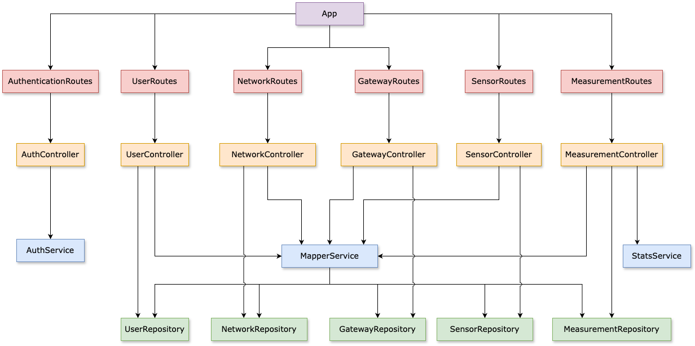
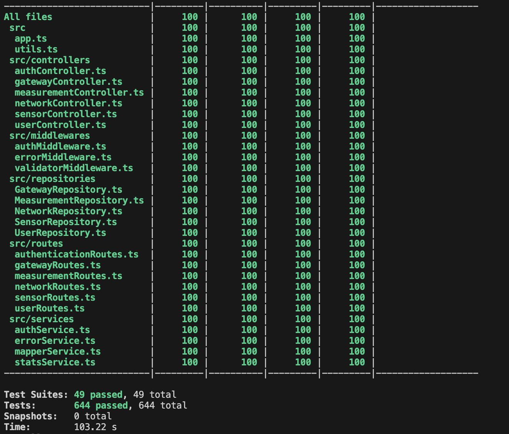

# Test Report

<The goal of this document is to explain how the application was tested, detailing how the test cases were defined and what they cover>

# Contents

- [Test Report](#test-report)
- [Contents](#contents)
- [Dependency graph](#dependency-graph)
- [Integration approach](#integration-approach)
- [Tests](#tests)
- [Coverage](#coverage)
  - [Coverage of FR](#coverage-of-fr)
  - [Coverage white box](#coverage-white-box)

# Dependency graph

# Integration approach

  L'approccio incrementale impiegato risulta essere **mixed**.
  A ciascuna delle principali entità del sistema (*User*, *Measurement*, *Gateway*, *Network*) è stata applicata una sequenza di integrazione che si articola in una prima fase di test unitari condotti su tutte le componenti (**service**, **controller**, **middleware** e **repository**). Questi rappresentano il punto di partenza per un primo livello di integration testing in isolamento cui segue un approccio **Top-down** che, a partire da route e middleware, prevede l’integrazione graduale di controller, service e repository.
  
  Si ha, ad esempio, per l'entità *Measurement*:

    Step 1: unit di measurementController, measurementRepository, mapperService, statsService

    Step 2: measurementRoute

    Step 3: measurementRoute + measurementController

    Step 4: measurementRoute + measurementController + mapperService

    Step 5: measurementRoute + measurementController + mapperService + statsService

    Step 6: measurementRoute + measurementController + mapperService + statsService + measurementRepository

In generale tutti gli stub sono stati implementati attraverso dei **mock**, eccezione fatta per il db, per il quale si è scelta la soluzione **in-memory**.

# Tests

<in the table below list the test cases defined For each test report the object tested, the test level (API, integration, unit) and the technique used to define the test case (BB/ eq partitioning, BB/ boundary, WB/ statement coverage, etc)> <split the table if needed>

| Test case name | Object(s) tested | Test level | Technique used |
| :------------: | :--------------: | :--------: | :------------: |
| NetworkRepository | NetworkRepository | Unit | 5 tests - BB (Equivalence Partitioning)   5 tests - WB (Exception Handling) |
| NetworkController | NetworkController | Unit | 5 tests - BB (Equivalence Partitioning)   5 tests - WB (Exception Handling) |
| mapperService | Network Creation | Unit | 1 test - BB (Equivalence Partitioning)   4 tests - BB (Boundary Value)|
| NetworkController | NetworkController | Integration | 5 tests - BB (Equivalence Partitioning)   5 tests - WB (Exception Handling) |
| NetworkRoutes | NetworkRoutes | Integration |  5 tests - BB (Equivalence Partitioning)  S 17 tests - WB (Exception Handling) |
| NetworkRoutes | NetworkRoutes | e2e |  5 tests - BB (Equivalence Partitioning)   15 tests - WB (Exception Handling) |
| GatewayRepository | GatewayRepository | Unit | 4 tests - BB (Equivalence Partitioning)   6 tests - BB (Boundary Value)   9 tests - WB (Exception Handling) |
| GatewayController | GatewayController | Unit | 5 tests - BB (Equivalence Partitioning)   1 tests - BB (Boundary Value)   7 tests - WB (Exception Handling) |
| mapperService | Gateway Creation | Unit | 1 test - BB (Equivalence Partitioning)   4 tests - BB (Boundary Value)|
| GatewayController | GatewayController | Integration | 7 tests - BB (Equivalence Partitioning)   2 test - BB (Boundary Value)   9 tests - WB (Exception Handling) |
| GatewayRoutes | GatewayRoutes | Integration |  5 tests - BB (Equivalence Partitioning)    22 tests - WB (Exception Handling) |
| GatewayRoutes | GatewayRoutes | e2e |  5 tests - BB (Equivalence Partitioning)   7 test - BB (Boundary Value)   17 tests - WB (Exception Handling) |
| SensorRepository | SensorRepository | Unit |  5 tests - BB (Equivalence Partitioning)    2 tests - BB (Boundary Value)   9 tests - WB (Exception Handling) |
| SensorController | SensorController | Unit | 5 tests - BB (Equivalence Partitioning)    5 tests - WB (Exception Handling) |
| mapperService | Sensor Creation | Unit | 1 test - BB (Equivalence Partitioning)   4 tests - BB (Boundary Value)|
| SensorController | SensorController | Integration | 7 tests - BB (Equivalence Partitioning)   2 test - BB (Boundary Value)   9 tests - WB (Exception Handling) |
| SensorRoutes | SensorRoutes | Integration | 5 tests - BB (Equivalence Partitioning)    22 tests - WB (Exception Handling) |
| SensorRoutes | SensorRoutes | e2e |  5 tests - BB (Equivalence Partitioning)   7 test - BB (Boundary Value)   23 tests - WB (Exception Handling) |
| MeasurementRepository | MeasurementRepository | Unit | 15 tests - BB (Equivalence Partitioning)   5 tests - WB (Exception Handling) |
| MeasurementController | MeasurementController | Unit | 10 tests - BB (Equivalence Partitioning)   10 tests - WB (Exception Handling) |
| mapperService | Measurement, Measurements Creation | Unit | 3 tests - BB (Equivalence Partitioning)   17 tests - BB (Boundary Value) |
| statsService | stats, outliers | Unit | 11 tests - BB (Equivalence Partitioning)   7 tests - BB (Boundary Value) |
| MeasurementController | MeasurementController | Integration | 8 tests - BB (Equivalence Partitioning)   2 test - BB (Boundary Value)   9 tests - WB (Exception Handling) |
| MeasurementRoutes | MeasurementRoutes | Integration | 7 tests - BB (Equivalence Partitioning)   2 test - BB (Boundary Value)   20 tests - WB (Exception Handling) |
| MeasurementRoutes | MeasurementRoutes | e2e |  17 tests - BB (Equivalence Partitioning)   30 test - BB (Boundary Value)   51 tests - WB (Exception Handling) |

# Coverage

## Coverage of FR

<Report in the following table the coverage of functional requirements and scenarios(from official requirements) >

| Functional Requirement or scenario                  | Test(s) |
| :--------------------------------------------------:|:-------:|
| **FR1 Authentication**                              |**28**|
| FR1.1 Authenticate user                             |28|
| **FR2 Manage users**                                |**59**|
| FR2.1 Retrieve all users                            |10|
| FR2.2 Create a new user                             |19|
| FR2.3 Retrieve a specific user                      |16|
| FR2.4 Delete a specific user                        |14|
| **FR3 Manage networks**                             |**77**|
| FR3.1 Retrieve all networks                         |9|
| FR3.2 Create a new network                          |16|
| FR3.3 Retrieve a specific network                   |15|
| FR3.4 Update a network                              |23|
| FR3.5 Delete a specific network                     |14|
| **FR4 Manage gateways**                             |**111**|
| FR4.1 Retrieve all gateways of a network            |21|
| FR4.2 Create a new gateway for a network            |29|
| FR4.3 Retrieve a specific gateway                   |19|
| FR4.4 Update a gateway                              |24|
| FR4.5 Delete a specific gateway                     |18|
| **FR5 Manage sensors**                              |**110**|
| FR5.1 Retrieve all sensors of a gateway             |22|
| FR5.2 Create a new sensor for a gateway             |28|
| FR5.3 Retrieve a specific sensor                    |16|
| FR5.4 Update a sensor                               |24|
| FR5.5 Delete a specific sensor                      |20|
| **FR6 Manage measurements**                         |**230**|
| FR6.1 Retrieve measurements for sensors of network  |41|
| FR6.2 Retrieve statistics for sensors of network    |28|
| FR6.3 Retrieve outliers for sensors of network      |28|
| FR6.4 Store measurements for a specific sensor      |38|
| FR6.5 Retrieve measurements for a specific sensor   |39|
| FR6.6 Retrieve statistics for a specific sensor     |29|
| FR6.7 Retrieve outliers for a specific sensor       |27|

## Coverage white box

